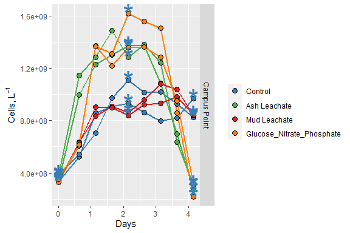
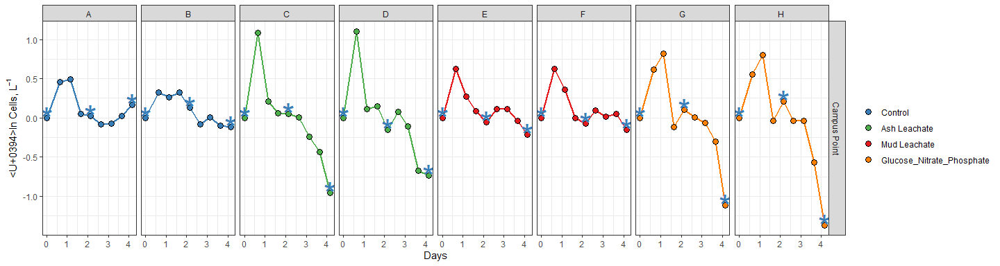
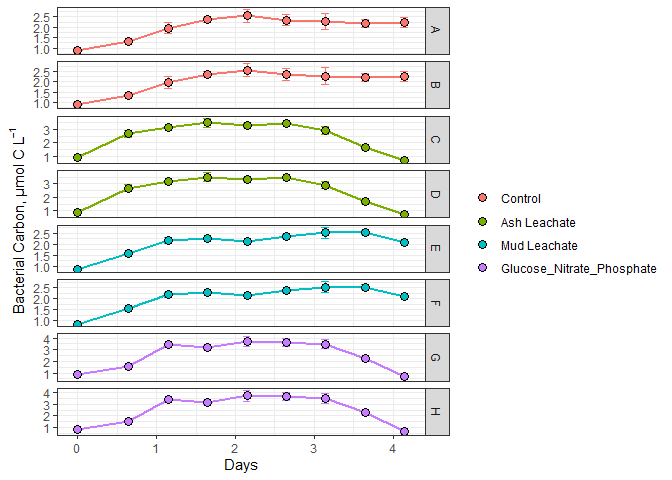

Bacterial Abundance Analysis
================
Melvin Lin
10/28/2020

``` r
library(tidyverse)
library(readxl)
library(lubridate)
```

# Import Data

``` r
excel_sheets("~/GITHUB/144l_students/Input_Data/week3/144L_2018_BactAbund.xlsx")
```

    ## [1] "Metadata" "Data"

``` r
metadatas <- read_excel("~/GITHUB/144l_students/Input_Data/week3/144L_2018_BactAbund.xlsx", sheet = "Metadata")
glimpse(metadatas)
```

    ## Rows: 80
    ## Columns: 16
    ## $ Experiment           <chr> "144L_2018", "144L_2018", "144L_2018", "144L_2...
    ## $ Location             <chr> "Campus Point", "Campus Point", "Campus Point"...
    ## $ Temperature          <dbl> 20, 20, 20, 20, 20, 20, 20, 20, 20, 20, 20, 20...
    ## $ Depth                <dbl> 1, 1, 1, 1, 1, 1, 1, 1, 1, 1, 1, 1, 1, 1, 1, 1...
    ## $ Bottle               <chr> "A", "A", "A", "A", "A", "A", "A", "A", "A", "...
    ## $ Timepoint            <dbl> 0, 1, 2, 3, 4, 5, 6, 7, 8, 9, 0, 1, 2, 3, 4, 5...
    ## $ Treatment            <chr> "Control", "Control", "Control", "Control", "C...
    ## $ Target_DOC_Amendment <dbl> 0, 0, 0, 0, 0, 0, 0, 0, 0, 0, 0, 0, 0, 0, 0, 0...
    ## $ Inoculum_L           <dbl> 1.5, 1.5, 1.5, 1.5, 1.5, 1.5, 1.5, 1.5, 1.5, 1...
    ## $ Media_L              <dbl> 3.5, 3.5, 3.5, 3.5, 3.5, 3.5, 3.5, 3.5, 3.5, 3...
    ## $ Datetime             <chr> "2018-10-15T16:30", "2018-10-16T08:00", "2018-...
    ## $ TOC_Sample           <lgl> TRUE, FALSE, FALSE, FALSE, TRUE, FALSE, FALSE,...
    ## $ Parallel_Sample      <lgl> TRUE, FALSE, FALSE, FALSE, TRUE, FALSE, FALSE,...
    ## $ Cell_Sample          <lgl> TRUE, TRUE, TRUE, TRUE, TRUE, TRUE, TRUE, TRUE...
    ## $ DNA_Sample           <lgl> TRUE, FALSE, FALSE, FALSE, TRUE, FALSE, FALSE,...
    ## $ DNA_SampleID         <chr> "144_A0_S6", NA, NA, NA, "144_A4_S7", NA, NA, ...

``` r
unique(metadatas$Experiment) # 1 experiment
```

    ## [1] "144L_2018"

``` r
unique(metadatas$Location) # 1 location
```

    ## [1] "Campus Point"

``` r
unique(metadatas$Bottle) #8 bottles
```

    ## [1] "A" "B" "C" "D" "E" "F" "G" "H"

``` r
unique(metadatas$Treatment) #4 treatments
```

    ## [1] "Control"                   "Ash Leachate"             
    ## [3] "Mud Leachate"              "Glucose_Nitrate_Phosphate"

``` r
data1 <- read_excel("~/GITHUB/144l_students/Input_Data/week3/144L_2018_BactAbund.xlsx", sheet = "Data")
glimpse(data1)
```

    ## Rows: 72
    ## Columns: 3
    ## $ Bottle    <chr> "A", "A", "A", "A", "A", "A", "A", "A", "A", "B", "B", "B...
    ## $ Timepoint <dbl> 0, 1, 2, 3, 4, 5, 6, 7, 8, 0, 1, 2, 3, 4, 5, 6, 7, 8, 0, ...
    ## $ Cells_ml  <dbl> 332531.5, 523943.1, 859019.9, 906998.9, 933025.2, 861129....

``` r
joined1 <- left_join(metadatas, data1)
```

    ## Joining, by = c("Bottle", "Timepoint")

``` r
names(joined1)
```

    ##  [1] "Experiment"           "Location"             "Temperature"         
    ##  [4] "Depth"                "Bottle"               "Timepoint"           
    ##  [7] "Treatment"            "Target_DOC_Amendment" "Inoculum_L"          
    ## [10] "Media_L"              "Datetime"             "TOC_Sample"          
    ## [13] "Parallel_Sample"      "Cell_Sample"          "DNA_Sample"          
    ## [16] "DNA_SampleID"         "Cells_ml"

``` r
# summary(joined1)
glimpse(joined1)
```

    ## Rows: 80
    ## Columns: 17
    ## $ Experiment           <chr> "144L_2018", "144L_2018", "144L_2018", "144L_2...
    ## $ Location             <chr> "Campus Point", "Campus Point", "Campus Point"...
    ## $ Temperature          <dbl> 20, 20, 20, 20, 20, 20, 20, 20, 20, 20, 20, 20...
    ## $ Depth                <dbl> 1, 1, 1, 1, 1, 1, 1, 1, 1, 1, 1, 1, 1, 1, 1, 1...
    ## $ Bottle               <chr> "A", "A", "A", "A", "A", "A", "A", "A", "A", "...
    ## $ Timepoint            <dbl> 0, 1, 2, 3, 4, 5, 6, 7, 8, 9, 0, 1, 2, 3, 4, 5...
    ## $ Treatment            <chr> "Control", "Control", "Control", "Control", "C...
    ## $ Target_DOC_Amendment <dbl> 0, 0, 0, 0, 0, 0, 0, 0, 0, 0, 0, 0, 0, 0, 0, 0...
    ## $ Inoculum_L           <dbl> 1.5, 1.5, 1.5, 1.5, 1.5, 1.5, 1.5, 1.5, 1.5, 1...
    ## $ Media_L              <dbl> 3.5, 3.5, 3.5, 3.5, 3.5, 3.5, 3.5, 3.5, 3.5, 3...
    ## $ Datetime             <chr> "2018-10-15T16:30", "2018-10-16T08:00", "2018-...
    ## $ TOC_Sample           <lgl> TRUE, FALSE, FALSE, FALSE, TRUE, FALSE, FALSE,...
    ## $ Parallel_Sample      <lgl> TRUE, FALSE, FALSE, FALSE, TRUE, FALSE, FALSE,...
    ## $ Cell_Sample          <lgl> TRUE, TRUE, TRUE, TRUE, TRUE, TRUE, TRUE, TRUE...
    ## $ DNA_Sample           <lgl> TRUE, FALSE, FALSE, FALSE, TRUE, FALSE, FALSE,...
    ## $ DNA_SampleID         <chr> "144_A0_S6", NA, NA, NA, "144_A4_S7", NA, NA, ...
    ## $ Cells_ml             <dbl> 332531.5, 523943.1, 859019.9, 906998.9, 933025...

# Prepare data set

``` r
cells1 <- joined1 %>% 
  mutate(Datetime = ymd_hm(Datetime),
         cells = Cells_ml * 1000) %>% 
  group_by(Treatment, Bottle) %>% 
  mutate(interv = interval(first(Datetime), Datetime),
         hours = interv/3600,
         days = hours/24) %>% 
  ungroup() %>% 
  select(Experiment:DNA_Sample, hours, days, cells) %>% 
  drop_na(cells)
  

glimpse(cells1)
```

    ## Rows: 72
    ## Columns: 18
    ## $ Experiment           <chr> "144L_2018", "144L_2018", "144L_2018", "144L_2...
    ## $ Location             <chr> "Campus Point", "Campus Point", "Campus Point"...
    ## $ Temperature          <dbl> 20, 20, 20, 20, 20, 20, 20, 20, 20, 20, 20, 20...
    ## $ Depth                <dbl> 1, 1, 1, 1, 1, 1, 1, 1, 1, 1, 1, 1, 1, 1, 1, 1...
    ## $ Bottle               <chr> "A", "A", "A", "A", "A", "A", "A", "A", "A", "...
    ## $ Timepoint            <dbl> 0, 1, 2, 3, 4, 5, 6, 7, 8, 0, 1, 2, 3, 4, 5, 6...
    ## $ Treatment            <chr> "Control", "Control", "Control", "Control", "C...
    ## $ Target_DOC_Amendment <dbl> 0, 0, 0, 0, 0, 0, 0, 0, 0, 0, 0, 0, 0, 0, 0, 0...
    ## $ Inoculum_L           <dbl> 1.5, 1.5, 1.5, 1.5, 1.5, 1.5, 1.5, 1.5, 1.5, 1...
    ## $ Media_L              <dbl> 3.5, 3.5, 3.5, 3.5, 3.5, 3.5, 3.5, 3.5, 3.5, 3...
    ## $ Datetime             <dttm> 2018-10-15 16:30:00, 2018-10-16 08:00:00, 201...
    ## $ TOC_Sample           <lgl> TRUE, FALSE, FALSE, FALSE, TRUE, FALSE, FALSE,...
    ## $ Parallel_Sample      <lgl> TRUE, FALSE, FALSE, FALSE, TRUE, FALSE, FALSE,...
    ## $ Cell_Sample          <lgl> TRUE, TRUE, TRUE, TRUE, TRUE, TRUE, TRUE, TRUE...
    ## $ DNA_Sample           <lgl> TRUE, FALSE, FALSE, FALSE, TRUE, FALSE, FALSE,...
    ## $ hours                <dbl> 0.0, 15.5, 27.5, 39.5, 51.5, 63.5, 75.5, 87.5,...
    ## $ days                 <dbl> 0.0000000, 0.6458333, 1.1458333, 1.6458333, 2....
    ## $ cells                <dbl> 332531522, 523943125, 859019934, 906998856, 93...

\#Plot growth curves

``` r
custom.colors <- c("Control" = "#377EB8", "Ash Leachate" = "#4DAF4A", "Mud Leachate" = "#E41A1C", "Glucose_Nitrate_Phosphate" = "#FF7F00")
levels <- c("Control", "Ash Leachate", "Mud Leachate", "Glucose_Nitrate_Phosphate")

cells1 %>% 
  mutate(dna = ifelse(DNA_Sample == T, "*", NA)) %>% 
  ggplot(aes(x = days, y = cells, group = interaction(Treatment, Bottle))) +
  geom_line(aes(color = factor(Treatment, levels = levels)), size = 1) +
  geom_point(aes(fill = factor(Treatment, levels = levels)), size = 3, color = "black", shape = 21) +
  geom_text(aes(label = dna), size = 12, color = "#377EB8") +
  labs(x = "Days", y = expression(paste("Cells, L"^-1)), fill = "") +
  guides(color = F) +
  scale_color_manual(values = custom.colors) +
  scale_fill_manual(values = custom.colors) +
  facet_grid(rows = "Location")
```

    ## Warning: Removed 48 rows containing missing values (geom_text).

<!-- -->

# Identify exponential phase of growth

``` r
ln_cells <- cells1 %>% 
  group_by(Treatment, Bottle) %>% 
  mutate(ln_cells = log(cells),
         diff_ln_cells = ln_cells - lag(ln_cells, default = first(ln_cells))) %>% 
  ungroup()
```

``` r
ln_cells %>% 
  mutate(dna = ifelse(DNA_Sample == T, "*", NA)) %>% 
  ggplot(aes(x = days, y = diff_ln_cells, group = interaction(Treatment, Bottle))) +
  geom_line(aes(color = factor(Treatment, levels = levels)), size = 1) +
  geom_point(aes(fill = factor(Treatment, levels = levels)), size = 3, color = "black", shape = 21) +
  geom_text(aes(label = dna), size = 12, color = "#377EB8") +
  labs(x = "Days", y = expression(paste("Δln Cells, L"^-1)), fill = "") +
  guides(color = F) +
  scale_color_manual(values = custom.colors) +
  scale_fill_manual(values = custom.colors) +
  facet_grid(Location~Bottle, scales = "free") +
  theme_bw()
```

    ## Warning: Removed 48 rows containing missing values (geom_text).

<!-- -->

Where exponential growth occurs for each bottle: - Bottle A \~0 - 1.2 d
(T1 - T3) - Bottle B \~0 - 0.6 d (T1 - T2) - Bottle C \~0 - 0.6 d (T1 -
T2) - Bottle D \~0 - 0.6 d (T1 - T2) - Bottle E \~0 - 0.6 d (T1 - T2) -
Bottle F \~0 - 0.6 d (T1 - T2) - Bottle G \~0 - 0.6 d (T1 - T3) - Bottle
H \~0 - 0.6 d (T1 - T3)

``` r
growth1 <- ln_cells %>% 
  mutate(exp_start = ifelse(Bottle == "A", 1, NA),
         exp_start = ifelse(Bottle == "B", 1, exp_start),
         exp_start = ifelse(Bottle == "C", 1, exp_start),
         exp_start = ifelse(Bottle == "D", 1, exp_start),
         exp_start = ifelse(Bottle == "E", 1, exp_start),
         exp_start = ifelse(Bottle == "F", 1, exp_start),
         exp_start = ifelse(Bottle == "G", 1, exp_start),
         exp_start = ifelse(Bottle == "H", 1, exp_start),
         exp_end = ifelse(Bottle == "A", 3, NA),
         exp_end = ifelse(Bottle == "B", 2, exp_end),
         exp_end = ifelse(Bottle == "C", 2, exp_end),
         exp_end = ifelse(Bottle == "D", 2, exp_end),
         exp_end = ifelse(Bottle == "E", 2, exp_end),
         exp_end = ifelse(Bottle == "F", 2, exp_end),
         exp_end = ifelse(Bottle == "G", 3, exp_end),
         exp_end = ifelse(Bottle == "H", 3, exp_end)) %>% 
  group_by(Treatment, Bottle) %>% 
  mutate(ln_cells_exp_start = ifelse(Timepoint == exp_start, ln_cells, NA),
         ln_cells_exp_end = ifelse(Timepoint == exp_end, ln_cells, NA),
         cells_exp_start = ifelse(Timepoint == exp_start, cells, NA),
         cells_exp_end = ifelse(Timepoint == exp_end, cells, NA),
         days_exp_start = ifelse(Timepoint == exp_start, days, NA),
         days_exp_end = ifelse(Timepoint == exp_end, days, NA)) %>% 
  fill(ln_cells_exp_start:days_exp_end, .direction = "updown") %>% 
 mutate(mew = (ln_cells_exp_end - ln_cells_exp_start)/(days_exp_end - days_exp_start),
         doubling = log(2)/mew,
         delta_cells = cells_exp_end - first(cells)) %>%
  ungroup()
  
check2 <- growth1 %>% 
select(Treatment, Bottle, Timepoint, exp_start, exp_end, ln_cells,  mew:delta_cells)

check <- growth1 %>% 
  select(Treatment, Bottle, Timepoint, exp_start, exp_end, ln_cells, ln_cells_exp_start:days_exp_end)

glimpse(growth1)
```

    ## Rows: 72
    ## Columns: 31
    ## $ Experiment           <chr> "144L_2018", "144L_2018", "144L_2018", "144L_2...
    ## $ Location             <chr> "Campus Point", "Campus Point", "Campus Point"...
    ## $ Temperature          <dbl> 20, 20, 20, 20, 20, 20, 20, 20, 20, 20, 20, 20...
    ## $ Depth                <dbl> 1, 1, 1, 1, 1, 1, 1, 1, 1, 1, 1, 1, 1, 1, 1, 1...
    ## $ Bottle               <chr> "A", "A", "A", "A", "A", "A", "A", "A", "A", "...
    ## $ Timepoint            <dbl> 0, 1, 2, 3, 4, 5, 6, 7, 8, 0, 1, 2, 3, 4, 5, 6...
    ## $ Treatment            <chr> "Control", "Control", "Control", "Control", "C...
    ## $ Target_DOC_Amendment <dbl> 0, 0, 0, 0, 0, 0, 0, 0, 0, 0, 0, 0, 0, 0, 0, 0...
    ## $ Inoculum_L           <dbl> 1.5, 1.5, 1.5, 1.5, 1.5, 1.5, 1.5, 1.5, 1.5, 1...
    ## $ Media_L              <dbl> 3.5, 3.5, 3.5, 3.5, 3.5, 3.5, 3.5, 3.5, 3.5, 3...
    ## $ Datetime             <dttm> 2018-10-15 16:30:00, 2018-10-16 08:00:00, 201...
    ## $ TOC_Sample           <lgl> TRUE, FALSE, FALSE, FALSE, TRUE, FALSE, FALSE,...
    ## $ Parallel_Sample      <lgl> TRUE, FALSE, FALSE, FALSE, TRUE, FALSE, FALSE,...
    ## $ Cell_Sample          <lgl> TRUE, TRUE, TRUE, TRUE, TRUE, TRUE, TRUE, TRUE...
    ## $ DNA_Sample           <lgl> TRUE, FALSE, FALSE, FALSE, TRUE, FALSE, FALSE,...
    ## $ hours                <dbl> 0.0, 15.5, 27.5, 39.5, 51.5, 63.5, 75.5, 87.5,...
    ## $ days                 <dbl> 0.0000000, 0.6458333, 1.1458333, 1.6458333, 2....
    ## $ cells                <dbl> 332531522, 523943125, 859019934, 906998856, 93...
    ## $ ln_cells             <dbl> 19.62225, 20.07689, 20.57130, 20.62565, 20.653...
    ## $ diff_ln_cells        <dbl> 0.000000000, 0.454648479, 0.494408990, 0.05434...
    ## $ exp_start            <dbl> 1, 1, 1, 1, 1, 1, 1, 1, 1, 1, 1, 1, 1, 1, 1, 1...
    ## $ exp_end              <dbl> 3, 3, 3, 3, 3, 3, 3, 3, 3, 2, 2, 2, 2, 2, 2, 2...
    ## $ ln_cells_exp_start   <dbl> 20.07689, 20.07689, 20.07689, 20.07689, 20.076...
    ## $ ln_cells_exp_end     <dbl> 20.62565, 20.62565, 20.62565, 20.62565, 20.625...
    ## $ cells_exp_start      <dbl> 523943125, 523943125, 523943125, 523943125, 52...
    ## $ cells_exp_end        <dbl> 906998856, 906998856, 906998856, 906998856, 90...
    ## $ days_exp_start       <dbl> 0.6458333, 0.6458333, 0.6458333, 0.6458333, 0....
    ## $ days_exp_end         <dbl> 1.645833, 1.645833, 1.645833, 1.645833, 1.6458...
    ## $ mew                  <dbl> 0.5487581, 0.5487581, 0.5487581, 0.5487581, 0....
    ## $ doubling             <dbl> 1.263120, 1.263120, 1.263120, 1.263120, 1.2631...
    ## $ delta_cells          <dbl> 574467334, 574467334, 574467334, 574467334, 57...

``` r
bactcarbon1 <- growth1 %>% 
  mutate(bc = cells * (2.5 * 10^-9),
         delta_bc = delta_cells * (2.5 * 10^-9))

glimpse(bactcarbon1)
```

    ## Rows: 72
    ## Columns: 33
    ## $ Experiment           <chr> "144L_2018", "144L_2018", "144L_2018", "144L_2...
    ## $ Location             <chr> "Campus Point", "Campus Point", "Campus Point"...
    ## $ Temperature          <dbl> 20, 20, 20, 20, 20, 20, 20, 20, 20, 20, 20, 20...
    ## $ Depth                <dbl> 1, 1, 1, 1, 1, 1, 1, 1, 1, 1, 1, 1, 1, 1, 1, 1...
    ## $ Bottle               <chr> "A", "A", "A", "A", "A", "A", "A", "A", "A", "...
    ## $ Timepoint            <dbl> 0, 1, 2, 3, 4, 5, 6, 7, 8, 0, 1, 2, 3, 4, 5, 6...
    ## $ Treatment            <chr> "Control", "Control", "Control", "Control", "C...
    ## $ Target_DOC_Amendment <dbl> 0, 0, 0, 0, 0, 0, 0, 0, 0, 0, 0, 0, 0, 0, 0, 0...
    ## $ Inoculum_L           <dbl> 1.5, 1.5, 1.5, 1.5, 1.5, 1.5, 1.5, 1.5, 1.5, 1...
    ## $ Media_L              <dbl> 3.5, 3.5, 3.5, 3.5, 3.5, 3.5, 3.5, 3.5, 3.5, 3...
    ## $ Datetime             <dttm> 2018-10-15 16:30:00, 2018-10-16 08:00:00, 201...
    ## $ TOC_Sample           <lgl> TRUE, FALSE, FALSE, FALSE, TRUE, FALSE, FALSE,...
    ## $ Parallel_Sample      <lgl> TRUE, FALSE, FALSE, FALSE, TRUE, FALSE, FALSE,...
    ## $ Cell_Sample          <lgl> TRUE, TRUE, TRUE, TRUE, TRUE, TRUE, TRUE, TRUE...
    ## $ DNA_Sample           <lgl> TRUE, FALSE, FALSE, FALSE, TRUE, FALSE, FALSE,...
    ## $ hours                <dbl> 0.0, 15.5, 27.5, 39.5, 51.5, 63.5, 75.5, 87.5,...
    ## $ days                 <dbl> 0.0000000, 0.6458333, 1.1458333, 1.6458333, 2....
    ## $ cells                <dbl> 332531522, 523943125, 859019934, 906998856, 93...
    ## $ ln_cells             <dbl> 19.62225, 20.07689, 20.57130, 20.62565, 20.653...
    ## $ diff_ln_cells        <dbl> 0.000000000, 0.454648479, 0.494408990, 0.05434...
    ## $ exp_start            <dbl> 1, 1, 1, 1, 1, 1, 1, 1, 1, 1, 1, 1, 1, 1, 1, 1...
    ## $ exp_end              <dbl> 3, 3, 3, 3, 3, 3, 3, 3, 3, 2, 2, 2, 2, 2, 2, 2...
    ## $ ln_cells_exp_start   <dbl> 20.07689, 20.07689, 20.07689, 20.07689, 20.076...
    ## $ ln_cells_exp_end     <dbl> 20.62565, 20.62565, 20.62565, 20.62565, 20.625...
    ## $ cells_exp_start      <dbl> 523943125, 523943125, 523943125, 523943125, 52...
    ## $ cells_exp_end        <dbl> 906998856, 906998856, 906998856, 906998856, 90...
    ## $ days_exp_start       <dbl> 0.6458333, 0.6458333, 0.6458333, 0.6458333, 0....
    ## $ days_exp_end         <dbl> 1.645833, 1.645833, 1.645833, 1.645833, 1.6458...
    ## $ mew                  <dbl> 0.5487581, 0.5487581, 0.5487581, 0.5487581, 0....
    ## $ doubling             <dbl> 1.263120, 1.263120, 1.263120, 1.263120, 1.2631...
    ## $ delta_cells          <dbl> 574467334, 574467334, 574467334, 574467334, 57...
    ## $ bc                   <dbl> 0.8313288, 1.3098578, 2.1475498, 2.2674971, 2....
    ## $ delta_bc             <dbl> 1.436168, 1.436168, 1.436168, 1.436168, 1.4361...

# Treatment averages

``` r
averages1 <- bactcarbon1 %>% 
  group_by(Treatment, Timepoint) %>% 
  mutate(ave_bc = mean(bc),
         sd_bc = sd(bc)) %>% 
  ungroup() %>% 
  group_by(Treatment) %>% 
  mutate(ave_mew = mean(mew),
         sd_mew = sd(mew),
         ave_doubling = mean(doubling),
         sd_doubling = sd(doubling),
         ave_delta_cells = mean(delta_cells),
         sd_delta_cells = sd(delta_cells),
         ave_delta_bc = mean(delta_bc),
         sd_delta_bc = sd(delta_bc),
         ave_lag = mean(days_exp_start),
         sd_lag = sd(days_exp_start)) %>% 
  ungroup()
glimpse(averages1)
```

    ## Rows: 72
    ## Columns: 45
    ## $ Experiment           <chr> "144L_2018", "144L_2018", "144L_2018", "144L_2...
    ## $ Location             <chr> "Campus Point", "Campus Point", "Campus Point"...
    ## $ Temperature          <dbl> 20, 20, 20, 20, 20, 20, 20, 20, 20, 20, 20, 20...
    ## $ Depth                <dbl> 1, 1, 1, 1, 1, 1, 1, 1, 1, 1, 1, 1, 1, 1, 1, 1...
    ## $ Bottle               <chr> "A", "A", "A", "A", "A", "A", "A", "A", "A", "...
    ## $ Timepoint            <dbl> 0, 1, 2, 3, 4, 5, 6, 7, 8, 0, 1, 2, 3, 4, 5, 6...
    ## $ Treatment            <chr> "Control", "Control", "Control", "Control", "C...
    ## $ Target_DOC_Amendment <dbl> 0, 0, 0, 0, 0, 0, 0, 0, 0, 0, 0, 0, 0, 0, 0, 0...
    ## $ Inoculum_L           <dbl> 1.5, 1.5, 1.5, 1.5, 1.5, 1.5, 1.5, 1.5, 1.5, 1...
    ## $ Media_L              <dbl> 3.5, 3.5, 3.5, 3.5, 3.5, 3.5, 3.5, 3.5, 3.5, 3...
    ## $ Datetime             <dttm> 2018-10-15 16:30:00, 2018-10-16 08:00:00, 201...
    ## $ TOC_Sample           <lgl> TRUE, FALSE, FALSE, FALSE, TRUE, FALSE, FALSE,...
    ## $ Parallel_Sample      <lgl> TRUE, FALSE, FALSE, FALSE, TRUE, FALSE, FALSE,...
    ## $ Cell_Sample          <lgl> TRUE, TRUE, TRUE, TRUE, TRUE, TRUE, TRUE, TRUE...
    ## $ DNA_Sample           <lgl> TRUE, FALSE, FALSE, FALSE, TRUE, FALSE, FALSE,...
    ## $ hours                <dbl> 0.0, 15.5, 27.5, 39.5, 51.5, 63.5, 75.5, 87.5,...
    ## $ days                 <dbl> 0.0000000, 0.6458333, 1.1458333, 1.6458333, 2....
    ## $ cells                <dbl> 332531522, 523943125, 859019934, 906998856, 93...
    ## $ ln_cells             <dbl> 19.62225, 20.07689, 20.57130, 20.62565, 20.653...
    ## $ diff_ln_cells        <dbl> 0.000000000, 0.454648479, 0.494408990, 0.05434...
    ## $ exp_start            <dbl> 1, 1, 1, 1, 1, 1, 1, 1, 1, 1, 1, 1, 1, 1, 1, 1...
    ## $ exp_end              <dbl> 3, 3, 3, 3, 3, 3, 3, 3, 3, 2, 2, 2, 2, 2, 2, 2...
    ## $ ln_cells_exp_start   <dbl> 20.07689, 20.07689, 20.07689, 20.07689, 20.076...
    ## $ ln_cells_exp_end     <dbl> 20.62565, 20.62565, 20.62565, 20.62565, 20.625...
    ## $ cells_exp_start      <dbl> 523943125, 523943125, 523943125, 523943125, 52...
    ## $ cells_exp_end        <dbl> 906998856, 906998856, 906998856, 906998856, 90...
    ## $ days_exp_start       <dbl> 0.6458333, 0.6458333, 0.6458333, 0.6458333, 0....
    ## $ days_exp_end         <dbl> 1.645833, 1.645833, 1.645833, 1.645833, 1.6458...
    ## $ mew                  <dbl> 0.5487581, 0.5487581, 0.5487581, 0.5487581, 0....
    ## $ doubling             <dbl> 1.263120, 1.263120, 1.263120, 1.263120, 1.2631...
    ## $ delta_cells          <dbl> 574467334, 574467334, 574467334, 574467334, 57...
    ## $ bc                   <dbl> 0.8313288, 1.3098578, 2.1475498, 2.2674971, 2....
    ## $ delta_bc             <dbl> 1.436168, 1.436168, 1.436168, 1.436168, 1.4361...
    ## $ ave_bc               <dbl> 0.9022187, 1.3301541, 1.9535757, 2.3515191, 2....
    ## $ sd_bc                <dbl> 0.10025342, 0.02870334, 0.27432087, 0.11882499...
    ## $ ave_mew              <dbl> 0.5390282, 0.5390282, 0.5390282, 0.5390282, 0....
    ## $ sd_mew               <dbl> 0.01001194, 0.01001194, 0.01001194, 0.01001194...
    ## $ ave_doubling         <dbl> 1.286339, 1.286339, 1.286339, 1.286339, 1.2863...
    ## $ sd_doubling          <dbl> 0.02389253, 0.02389253, 0.02389253, 0.02389253...
    ## $ ave_delta_cells      <dbl> 444532267, 444532267, 444532267, 444532267, 44...
    ## $ sd_delta_cells       <dbl> 133702081, 133702081, 133702081, 133702081, 13...
    ## $ ave_delta_bc         <dbl> 1.111331, 1.111331, 1.111331, 1.111331, 1.1113...
    ## $ sd_delta_bc          <dbl> 0.3342552, 0.3342552, 0.3342552, 0.3342552, 0....
    ## $ ave_lag              <dbl> 0.6458333, 0.6458333, 0.6458333, 0.6458333, 0....
    ## $ sd_lag               <dbl> 0, 0, 0, 0, 0, 0, 0, 0, 0, 0, 0, 0, 0, 0, 0, 0...

``` r
averages1 %>% 
  ggplot(aes(x = days, y = ave_bc), group = interaction(Treatment, Bottle)) +
  geom_errorbar(aes(ymin = ave_bc - sd_bc, ymax = ave_bc + sd_bc, color = factor(Treatment, levels = levels)), width = 0.1) +
  geom_line(aes(color = factor(Treatment, levels = levels)), size =1) +
  geom_point(aes(fill = factor(Treatment, levels = levels)), color = "black", shape = 21, size =3) +
    facet_grid(rows = "Bottle", scales = "free") +
  labs(x = "Days", y = expression("Bacterial Carbon, µmol C L"^-1), fill = "", color = "") +
  guides(color = F) +
  theme_bw()
```

<!-- -->

``` r
# This shows the change in bacterial carbon in each bottle. 
```

``` r
bar.data1 <- averages1 %>% 
  select(Bottle, Treatment, ave_mew:sd_lag) %>% 
  distinct()
```

Mew

``` r
bar.data1 %>% 
  ggplot(aes(x = factor(Treatment, levels = levels), y = ave_mew), group = interaction(Bottle, Treatment)) +
  geom_col(color = "black", fill = "white") +
  geom_errorbar(aes(ymin = ave_mew - sd_mew, ymax = ave_mew + sd_mew), width = 0.1) +
  facet_grid(~factor(Bottle, levels = levels), scales = "free") +
  labs(x = "", y = expression ("µ, d"^-1)) +
  theme_bw()
```

<!-- -->

Doubling

``` r
bar.data1 %>% 
  ggplot(aes(x = factor(Treatment, levels = levels), y = ave_doubling), group = interaction(Bottle, Treatment)) +
  geom_col(color = "black", fill = "white") +
  geom_errorbar(aes(ymin = ave_doubling - sd_doubling, ymax = ave_doubling + sd_doubling), width = 0.1) +
  facet_grid(~factor(Bottle, levels = levels), scales = "free") +
  labs(x = "", y = expression ("Doubling Time, d")) +
  theme_bw()
```

<!-- -->

delta\_bc

``` r
bar.data1 %>% 
  ggplot(aes(x = factor(Treatment, levels = levels), y = ave_delta_bc), group = interaction(Bottle, Treatment)) +
  geom_col(color = "black", fill = "white") +
  geom_errorbar(aes(ymin = ave_delta_bc - sd_delta_bc, ymax = ave_delta_bc + sd_delta_bc), width = 0.1) +
  facet_grid(~factor(Bottle, levels = levels), scales = "free") +
  labs(x = "", y = expression ("Δ Bacterial Carbon, µmol C L"^-1)) +
  theme_bw()
```

<!-- -->
\# Save Data

``` r
saveRDS(averages1, "~/GITHUB/144l_students/Output_Data/week3/BactAbundanceAnalysis.rds")

write_csv(averages1, "~/GITHUB/144l_students/Output_Data/week3/BactAbundanceAnalysis.csv")
```
