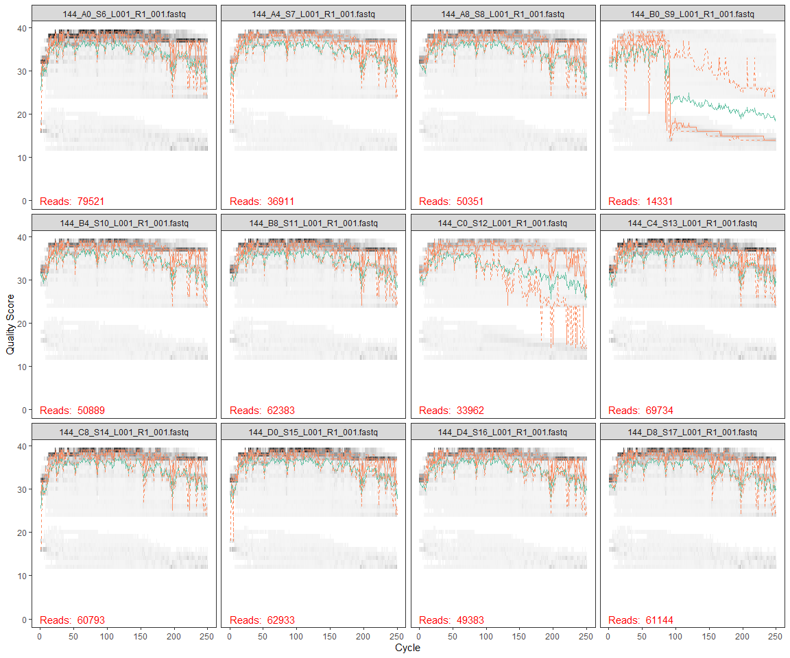
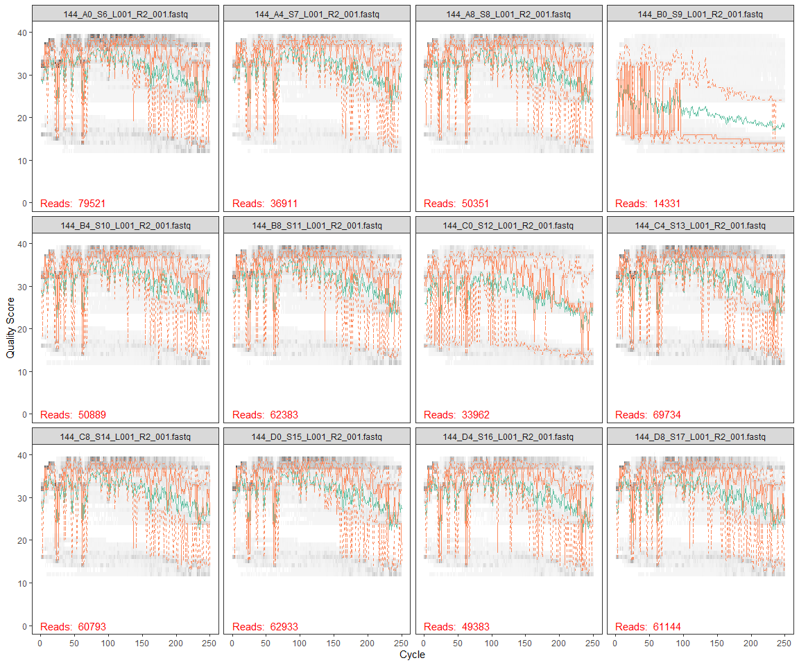
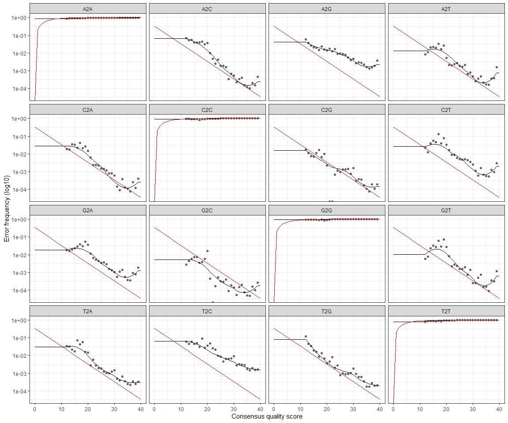
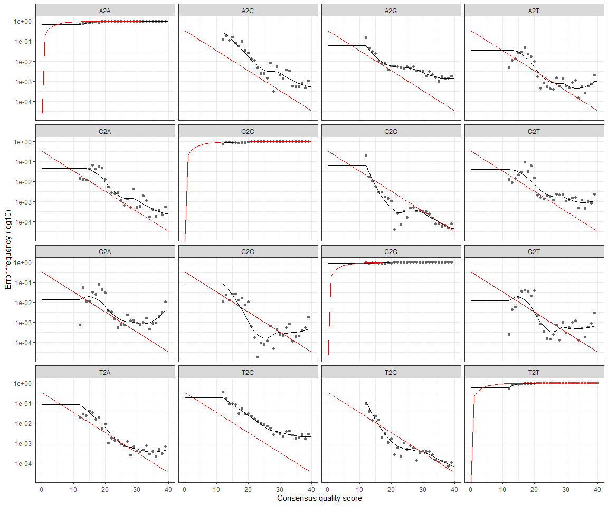

DADA2 144L\_2018
================
Melvin Lin
11/11/2020

# Install and Load DADA2 and ShortRead from Bioconductor

``` r
#install.packages("devtools")
#library("devtools")
#devtools::install_github("benjjneb/dada2", ref="v1.16")
```

``` r
#library("devtools")
#devtools::install_github("benjjneb/dada2")
```

``` r
library(dada2)
```

    ## Loading required package: Rcpp

``` r
library(ShortRead)
```

    ## Loading required package: BiocGenerics

    ## Loading required package: parallel

    ## 
    ## Attaching package: 'BiocGenerics'

    ## The following objects are masked from 'package:parallel':
    ## 
    ##     clusterApply, clusterApplyLB, clusterCall, clusterEvalQ,
    ##     clusterExport, clusterMap, parApply, parCapply, parLapply,
    ##     parLapplyLB, parRapply, parSapply, parSapplyLB

    ## The following objects are masked from 'package:stats':
    ## 
    ##     IQR, mad, sd, var, xtabs

    ## The following objects are masked from 'package:base':
    ## 
    ##     anyDuplicated, append, as.data.frame, basename, cbind, colnames,
    ##     dirname, do.call, duplicated, eval, evalq, Filter, Find, get, grep,
    ##     grepl, intersect, is.unsorted, lapply, Map, mapply, match, mget,
    ##     order, paste, pmax, pmax.int, pmin, pmin.int, Position, rank,
    ##     rbind, Reduce, rownames, sapply, setdiff, sort, table, tapply,
    ##     union, unique, unsplit, which.max, which.min

    ## Loading required package: BiocParallel

    ## Loading required package: Biostrings

    ## Loading required package: S4Vectors

    ## Loading required package: stats4

    ## 
    ## Attaching package: 'S4Vectors'

    ## The following object is masked from 'package:base':
    ## 
    ##     expand.grid

    ## Loading required package: IRanges

    ## 
    ## Attaching package: 'IRanges'

    ## The following object is masked from 'package:grDevices':
    ## 
    ##     windows

    ## Loading required package: XVector

    ## 
    ## Attaching package: 'Biostrings'

    ## The following object is masked from 'package:base':
    ## 
    ##     strsplit

    ## Loading required package: Rsamtools

    ## Loading required package: GenomeInfoDb

    ## Loading required package: GenomicRanges

    ## Loading required package: GenomicAlignments

    ## Loading required package: SummarizedExperiment

    ## Loading required package: MatrixGenerics

    ## Loading required package: matrixStats

    ## 
    ## Attaching package: 'MatrixGenerics'

    ## The following objects are masked from 'package:matrixStats':
    ## 
    ##     colAlls, colAnyNAs, colAnys, colAvgsPerRowSet, colCollapse,
    ##     colCounts, colCummaxs, colCummins, colCumprods, colCumsums,
    ##     colDiffs, colIQRDiffs, colIQRs, colLogSumExps, colMadDiffs,
    ##     colMads, colMaxs, colMeans2, colMedians, colMins, colOrderStats,
    ##     colProds, colQuantiles, colRanges, colRanks, colSdDiffs, colSds,
    ##     colSums2, colTabulates, colVarDiffs, colVars, colWeightedMads,
    ##     colWeightedMeans, colWeightedMedians, colWeightedSds,
    ##     colWeightedVars, rowAlls, rowAnyNAs, rowAnys, rowAvgsPerColSet,
    ##     rowCollapse, rowCounts, rowCummaxs, rowCummins, rowCumprods,
    ##     rowCumsums, rowDiffs, rowIQRDiffs, rowIQRs, rowLogSumExps,
    ##     rowMadDiffs, rowMads, rowMaxs, rowMeans2, rowMedians, rowMins,
    ##     rowOrderStats, rowProds, rowQuantiles, rowRanges, rowRanks,
    ##     rowSdDiffs, rowSds, rowSums2, rowTabulates, rowVarDiffs, rowVars,
    ##     rowWeightedMads, rowWeightedMeans, rowWeightedMedians,
    ##     rowWeightedSds, rowWeightedVars

    ## Loading required package: Biobase

    ## Welcome to Bioconductor
    ## 
    ##     Vignettes contain introductory material; view with
    ##     'browseVignettes()'. To cite Bioconductor, see
    ##     'citation("Biobase")', and for packages 'citation("pkgname")'.

    ## 
    ## Attaching package: 'Biobase'

    ## The following object is masked from 'package:MatrixGenerics':
    ## 
    ##     rowMedians

    ## The following objects are masked from 'package:matrixStats':
    ## 
    ##     anyMissing, rowMedians

``` r
# install.packages("dplyr")
# install.packages("tidyverse")
library(tidyverse)
```

    ## -- Attaching packages --------------------------------------- tidyverse 1.3.0 --

    ## v ggplot2 3.3.2     v purrr   0.3.4
    ## v tibble  3.0.4     v dplyr   1.0.2
    ## v tidyr   1.1.2     v stringr 1.4.0
    ## v readr   1.4.0     v forcats 0.5.0

    ## -- Conflicts ------------------------------------------ tidyverse_conflicts() --
    ## x dplyr::collapse()   masks Biostrings::collapse(), IRanges::collapse()
    ## x dplyr::combine()    masks Biobase::combine(), BiocGenerics::combine()
    ## x purrr::compact()    masks XVector::compact()
    ## x purrr::compose()    masks ShortRead::compose()
    ## x dplyr::count()      masks matrixStats::count()
    ## x dplyr::desc()       masks IRanges::desc()
    ## x tidyr::expand()     masks S4Vectors::expand()
    ## x dplyr::filter()     masks stats::filter()
    ## x dplyr::first()      masks GenomicAlignments::first(), S4Vectors::first()
    ## x dplyr::id()         masks ShortRead::id()
    ## x dplyr::lag()        masks stats::lag()
    ## x dplyr::last()       masks GenomicAlignments::last()
    ## x ggplot2::Position() masks BiocGenerics::Position(), base::Position()
    ## x purrr::reduce()     masks GenomicRanges::reduce(), IRanges::reduce()
    ## x dplyr::rename()     masks S4Vectors::rename()
    ## x dplyr::slice()      masks XVector::slice(), IRanges::slice()
    ## x tibble::view()      masks ShortRead::view()

``` r
path1 <- "~/GITHUB/144l_students/Input_Data/week5/EEMB144L_2018_fastq/"

#storing the names of forward and reverse files as lists
fnFs <- list.files(path1, pattern = "_R1_001.fastq", full.names = TRUE)
fnRs <- list.files(path1, pattern = "_R2_001.fastq", full.names = TRUE)
```

``` r
#store the forward and reverse primers
FWD = "GTGYCAGCMGCCGCGGTAA"
REV = "GGACTACNVGGGTWTCTAAT"

allOrients <- function(primer) {
  require(Biostrings)
  dna <- DNAString(primer)
  orients <- c(Forward = dna, Complement = complement(dna), Reverse = reverse(dna),
               RevComp = reverseComplement(dna))
  return(sapply(orients, toString))
}

#store the fwd and reverse orientations separately 
FWD.orients <- allOrients(FWD)
REV.orients <- allOrients(REV)

#view the orientations of the primers
FWD.orients
```

    ##               Forward            Complement               Reverse 
    ## "GTGYCAGCMGCCGCGGTAA" "CACRGTCGKCGGCGCCATT" "AATGGCGCCGMCGACYGTG" 
    ##               RevComp 
    ## "TTACCGCGGCKGCTGRCAC"

``` r
REV.orients
```

    ##                Forward             Complement                Reverse 
    ## "GGACTACNVGGGTWTCTAAT" "CCTGATGNBCCCAWAGATTA" "TAATCTWTGGGVNCATCAGG" 
    ##                RevComp 
    ## "ATTAGAWACCCBNGTAGTCC"

# Search for Primers

``` r
primerHits <- function(primer, fn) {
  # Counts number of reads in which the primer is found
  nhits <- vcountPattern(primer, sread(readFastq(fn)), fixed = FALSE)
  return(sum(nhits > 0))
}

rbind(FWD.ForwardReads = sapply(FWD.orients, primerHits, fn = fnFs[[1]]),
      FWD.ReverseReads = sapply(FWD.orients, primerHits, fn = fnFs[[1]]),
      REV.ForwardReads = sapply(FWD.orients, primerHits, fn = fnFs[[1]]),
      REV.ReverseReads = sapply(FWD.orients, primerHits, fn = fnFs[[1]]))
```

    ##                  Forward Complement Reverse RevComp
    ## FWD.ForwardReads       0          0       0       0
    ## FWD.ReverseReads       0          0       0       0
    ## REV.ForwardReads       0          0       0       0
    ## REV.ReverseReads       0          0       0       0

``` r
# All numbers are 0, so there are no primers in the sequence
```

# Inspect read quality profiles

## Forward reads

``` r
plotQualityProfile((fnFs[1:12]))
```

<!-- -->

## Reverse reads

``` r
plotQualityProfile(fnRs[1:12])
```

<!-- -->

# Filtering and Trimming

``` r
#Get the sample names
#define the basename of the FnFs as the first part of each fastQ file name until "_L"
#apply this to all samples
sample.names <- sapply(strsplit(basename(fnFs), "_L"), `[`, 1)
sample.names
```

    ##  [1] "144_A0_S6"  "144_A4_S7"  "144_A8_S8"  "144_B0_S9"  "144_B4_S10"
    ##  [6] "144_B8_S11" "144_C0_S12" "144_C4_S13" "144_C8_S14" "144_D0_S15"
    ## [11] "144_D4_S16" "144_D8_S17" "144_E0_S18" "144_E4_S19" "144_E8_S20"
    ## [16] "144_F0_S21" "144_F4_S22" "144_F8_S23" "144_G0_S24" "144_G4_S25"
    ## [21] "144_G8_S26" "144_H0_S27" "144_H4_S28" "144_H8_S29"

``` r
#create a "filtered" folder in the working directory as a place to put all new filtered fastQ files

filt_path <- file.path(path1,"filtered")
#add the appropriate designation string to any new files made that will be put into the "filtered" folder
filtFs <- file.path(filt_path, paste0(sample.names, "_F_filt.fastq"))
filtRs <- file.path(filt_path, paste0(sample.names, "_R_filt.fastq"))
```

``` r
out <- filterAndTrim(fnFs, filtFs, fnRs, filtRs, truncLen = c(240,150), maxN = 0, maxEE = c(2,2), truncQ = 2, rm.phix = TRUE, compress = TRUE)
#look at the output. this tells you how many reads were removed
out
```

    ##                              reads.in reads.out
    ## 144_A0_S6_L001_R1_001.fastq     79521     67972
    ## 144_A4_S7_L001_R1_001.fastq     36911     32141
    ## 144_A8_S8_L001_R1_001.fastq     50351     43213
    ## 144_B0_S9_L001_R1_001.fastq     14331      3070
    ## 144_B4_S10_L001_R1_001.fastq    50889     43678
    ## 144_B8_S11_L001_R1_001.fastq    62383     53847
    ## 144_C0_S12_L001_R1_001.fastq    33962     24060
    ## 144_C4_S13_L001_R1_001.fastq    69734     60423
    ## 144_C8_S14_L001_R1_001.fastq    60793     52969
    ## 144_D0_S15_L001_R1_001.fastq    62933     56012
    ## 144_D4_S16_L001_R1_001.fastq    49383     43001
    ## 144_D8_S17_L001_R1_001.fastq    61144     52929
    ## 144_E0_S18_L001_R1_001.fastq    53714     47453
    ## 144_E4_S19_L001_R1_001.fastq    41686     35888
    ## 144_E8_S20_L001_R1_001.fastq    34947     29277
    ## 144_F0_S21_L001_R1_001.fastq    54554     48269
    ## 144_F4_S22_L001_R1_001.fastq    32800     28766
    ## 144_F8_S23_L001_R1_001.fastq    33312     30014
    ## 144_G0_S24_L001_R1_001.fastq    40935     36168
    ## 144_G4_S25_L001_R1_001.fastq    40109     35236
    ## 144_G8_S26_L001_R1_001.fastq    35610     31788
    ## 144_H0_S27_L001_R1_001.fastq    63711     57388
    ## 144_H4_S28_L001_R1_001.fastq    27892     24291
    ## 144_H8_S29_L001_R1_001.fastq    36860     32338

\#Learn the error rates

``` r
errF <- learnErrors(filtFs, multithread = TRUE)
```

    ## 104972400 total bases in 437385 reads from 10 samples will be used for learning the error rates.

``` r
errR <- learnErrors(filtRs, multithread = TRUE)
```

    ## 104130300 total bases in 694202 reads from 16 samples will be used for learning the error rates.





\#Dereplication

Dada2 combines all identical sequences into one unique sequence, keeping
track of the number of identical sequences

``` r
derepFs <- derepFastq(filtFs, verbose = TRUE)
```

    ## Dereplicating sequence entries in Fastq file: ~/GITHUB/144l_students/Input_Data/week5/EEMB144L_2018_fastq//filtered/144_A0_S6_F_filt.fastq

    ## Encountered 18932 unique sequences from 67972 total sequences read.

    ## Dereplicating sequence entries in Fastq file: ~/GITHUB/144l_students/Input_Data/week5/EEMB144L_2018_fastq//filtered/144_A4_S7_F_filt.fastq

    ## Encountered 9208 unique sequences from 32141 total sequences read.

    ## Dereplicating sequence entries in Fastq file: ~/GITHUB/144l_students/Input_Data/week5/EEMB144L_2018_fastq//filtered/144_A8_S8_F_filt.fastq

    ## Encountered 12497 unique sequences from 43213 total sequences read.

    ## Dereplicating sequence entries in Fastq file: ~/GITHUB/144l_students/Input_Data/week5/EEMB144L_2018_fastq//filtered/144_B0_S9_F_filt.fastq

    ## Encountered 1382 unique sequences from 3070 total sequences read.

    ## Dereplicating sequence entries in Fastq file: ~/GITHUB/144l_students/Input_Data/week5/EEMB144L_2018_fastq//filtered/144_B4_S10_F_filt.fastq

    ## Encountered 11805 unique sequences from 43678 total sequences read.

    ## Dereplicating sequence entries in Fastq file: ~/GITHUB/144l_students/Input_Data/week5/EEMB144L_2018_fastq//filtered/144_B8_S11_F_filt.fastq

    ## Encountered 14833 unique sequences from 53847 total sequences read.

    ## Dereplicating sequence entries in Fastq file: ~/GITHUB/144l_students/Input_Data/week5/EEMB144L_2018_fastq//filtered/144_C0_S12_F_filt.fastq

    ## Encountered 7856 unique sequences from 24060 total sequences read.

    ## Dereplicating sequence entries in Fastq file: ~/GITHUB/144l_students/Input_Data/week5/EEMB144L_2018_fastq//filtered/144_C4_S13_F_filt.fastq

    ## Encountered 13719 unique sequences from 60423 total sequences read.

    ## Dereplicating sequence entries in Fastq file: ~/GITHUB/144l_students/Input_Data/week5/EEMB144L_2018_fastq//filtered/144_C8_S14_F_filt.fastq

    ## Encountered 14168 unique sequences from 52969 total sequences read.

    ## Dereplicating sequence entries in Fastq file: ~/GITHUB/144l_students/Input_Data/week5/EEMB144L_2018_fastq//filtered/144_D0_S15_F_filt.fastq

    ## Encountered 15521 unique sequences from 56012 total sequences read.

    ## Dereplicating sequence entries in Fastq file: ~/GITHUB/144l_students/Input_Data/week5/EEMB144L_2018_fastq//filtered/144_D4_S16_F_filt.fastq

    ## Encountered 9469 unique sequences from 43001 total sequences read.

    ## Dereplicating sequence entries in Fastq file: ~/GITHUB/144l_students/Input_Data/week5/EEMB144L_2018_fastq//filtered/144_D8_S17_F_filt.fastq

    ## Encountered 14768 unique sequences from 52929 total sequences read.

    ## Dereplicating sequence entries in Fastq file: ~/GITHUB/144l_students/Input_Data/week5/EEMB144L_2018_fastq//filtered/144_E0_S18_F_filt.fastq

    ## Encountered 13712 unique sequences from 47453 total sequences read.

    ## Dereplicating sequence entries in Fastq file: ~/GITHUB/144l_students/Input_Data/week5/EEMB144L_2018_fastq//filtered/144_E4_S19_F_filt.fastq

    ## Encountered 9521 unique sequences from 35888 total sequences read.

    ## Dereplicating sequence entries in Fastq file: ~/GITHUB/144l_students/Input_Data/week5/EEMB144L_2018_fastq//filtered/144_E8_S20_F_filt.fastq

    ## Encountered 8628 unique sequences from 29277 total sequences read.

    ## Dereplicating sequence entries in Fastq file: ~/GITHUB/144l_students/Input_Data/week5/EEMB144L_2018_fastq//filtered/144_F0_S21_F_filt.fastq

    ## Encountered 14157 unique sequences from 48269 total sequences read.

    ## Dereplicating sequence entries in Fastq file: ~/GITHUB/144l_students/Input_Data/week5/EEMB144L_2018_fastq//filtered/144_F4_S22_F_filt.fastq

    ## Encountered 8088 unique sequences from 28766 total sequences read.

    ## Dereplicating sequence entries in Fastq file: ~/GITHUB/144l_students/Input_Data/week5/EEMB144L_2018_fastq//filtered/144_F8_S23_F_filt.fastq

    ## Encountered 8155 unique sequences from 30014 total sequences read.

    ## Dereplicating sequence entries in Fastq file: ~/GITHUB/144l_students/Input_Data/week5/EEMB144L_2018_fastq//filtered/144_G0_S24_F_filt.fastq

    ## Encountered 10822 unique sequences from 36168 total sequences read.

    ## Dereplicating sequence entries in Fastq file: ~/GITHUB/144l_students/Input_Data/week5/EEMB144L_2018_fastq//filtered/144_G4_S25_F_filt.fastq

    ## Encountered 8483 unique sequences from 35236 total sequences read.

    ## Dereplicating sequence entries in Fastq file: ~/GITHUB/144l_students/Input_Data/week5/EEMB144L_2018_fastq//filtered/144_G8_S26_F_filt.fastq

    ## Encountered 8503 unique sequences from 31788 total sequences read.

    ## Dereplicating sequence entries in Fastq file: ~/GITHUB/144l_students/Input_Data/week5/EEMB144L_2018_fastq//filtered/144_H0_S27_F_filt.fastq

    ## Encountered 15044 unique sequences from 57388 total sequences read.

    ## Dereplicating sequence entries in Fastq file: ~/GITHUB/144l_students/Input_Data/week5/EEMB144L_2018_fastq//filtered/144_H4_S28_F_filt.fastq

    ## Encountered 5919 unique sequences from 24291 total sequences read.

    ## Dereplicating sequence entries in Fastq file: ~/GITHUB/144l_students/Input_Data/week5/EEMB144L_2018_fastq//filtered/144_H8_S29_F_filt.fastq

    ## Encountered 9702 unique sequences from 32338 total sequences read.

``` r
derepRs <- derepFastq(filtRs, verbose = TRUE)
```

    ## Dereplicating sequence entries in Fastq file: ~/GITHUB/144l_students/Input_Data/week5/EEMB144L_2018_fastq//filtered/144_A0_S6_R_filt.fastq

    ## Encountered 22356 unique sequences from 67972 total sequences read.

    ## Dereplicating sequence entries in Fastq file: ~/GITHUB/144l_students/Input_Data/week5/EEMB144L_2018_fastq//filtered/144_A4_S7_R_filt.fastq

    ## Encountered 10600 unique sequences from 32141 total sequences read.

    ## Dereplicating sequence entries in Fastq file: ~/GITHUB/144l_students/Input_Data/week5/EEMB144L_2018_fastq//filtered/144_A8_S8_R_filt.fastq

    ## Encountered 15296 unique sequences from 43213 total sequences read.

    ## Dereplicating sequence entries in Fastq file: ~/GITHUB/144l_students/Input_Data/week5/EEMB144L_2018_fastq//filtered/144_B0_S9_R_filt.fastq

    ## Encountered 1593 unique sequences from 3070 total sequences read.

    ## Dereplicating sequence entries in Fastq file: ~/GITHUB/144l_students/Input_Data/week5/EEMB144L_2018_fastq//filtered/144_B4_S10_R_filt.fastq

    ## Encountered 14378 unique sequences from 43678 total sequences read.

    ## Dereplicating sequence entries in Fastq file: ~/GITHUB/144l_students/Input_Data/week5/EEMB144L_2018_fastq//filtered/144_B8_S11_R_filt.fastq

    ## Encountered 19110 unique sequences from 53847 total sequences read.

    ## Dereplicating sequence entries in Fastq file: ~/GITHUB/144l_students/Input_Data/week5/EEMB144L_2018_fastq//filtered/144_C0_S12_R_filt.fastq

    ## Encountered 11295 unique sequences from 24060 total sequences read.

    ## Dereplicating sequence entries in Fastq file: ~/GITHUB/144l_students/Input_Data/week5/EEMB144L_2018_fastq//filtered/144_C4_S13_R_filt.fastq

    ## Encountered 17845 unique sequences from 60423 total sequences read.

    ## Dereplicating sequence entries in Fastq file: ~/GITHUB/144l_students/Input_Data/week5/EEMB144L_2018_fastq//filtered/144_C8_S14_R_filt.fastq

    ## Encountered 17700 unique sequences from 52969 total sequences read.

    ## Dereplicating sequence entries in Fastq file: ~/GITHUB/144l_students/Input_Data/week5/EEMB144L_2018_fastq//filtered/144_D0_S15_R_filt.fastq

    ## Encountered 19854 unique sequences from 56012 total sequences read.

    ## Dereplicating sequence entries in Fastq file: ~/GITHUB/144l_students/Input_Data/week5/EEMB144L_2018_fastq//filtered/144_D4_S16_R_filt.fastq

    ## Encountered 13776 unique sequences from 43001 total sequences read.

    ## Dereplicating sequence entries in Fastq file: ~/GITHUB/144l_students/Input_Data/week5/EEMB144L_2018_fastq//filtered/144_D8_S17_R_filt.fastq

    ## Encountered 19687 unique sequences from 52929 total sequences read.

    ## Dereplicating sequence entries in Fastq file: ~/GITHUB/144l_students/Input_Data/week5/EEMB144L_2018_fastq//filtered/144_E0_S18_R_filt.fastq

    ## Encountered 17696 unique sequences from 47453 total sequences read.

    ## Dereplicating sequence entries in Fastq file: ~/GITHUB/144l_students/Input_Data/week5/EEMB144L_2018_fastq//filtered/144_E4_S19_R_filt.fastq

    ## Encountered 13559 unique sequences from 35888 total sequences read.

    ## Dereplicating sequence entries in Fastq file: ~/GITHUB/144l_students/Input_Data/week5/EEMB144L_2018_fastq//filtered/144_E8_S20_R_filt.fastq

    ## Encountered 14855 unique sequences from 29277 total sequences read.

    ## Dereplicating sequence entries in Fastq file: ~/GITHUB/144l_students/Input_Data/week5/EEMB144L_2018_fastq//filtered/144_F0_S21_R_filt.fastq

    ## Encountered 18646 unique sequences from 48269 total sequences read.

    ## Dereplicating sequence entries in Fastq file: ~/GITHUB/144l_students/Input_Data/week5/EEMB144L_2018_fastq//filtered/144_F4_S22_R_filt.fastq

    ## Encountered 9704 unique sequences from 28766 total sequences read.

    ## Dereplicating sequence entries in Fastq file: ~/GITHUB/144l_students/Input_Data/week5/EEMB144L_2018_fastq//filtered/144_F8_S23_R_filt.fastq

    ## Encountered 9645 unique sequences from 30014 total sequences read.

    ## Dereplicating sequence entries in Fastq file: ~/GITHUB/144l_students/Input_Data/week5/EEMB144L_2018_fastq//filtered/144_G0_S24_R_filt.fastq

    ## Encountered 13092 unique sequences from 36168 total sequences read.

    ## Dereplicating sequence entries in Fastq file: ~/GITHUB/144l_students/Input_Data/week5/EEMB144L_2018_fastq//filtered/144_G4_S25_R_filt.fastq

    ## Encountered 11615 unique sequences from 35236 total sequences read.

    ## Dereplicating sequence entries in Fastq file: ~/GITHUB/144l_students/Input_Data/week5/EEMB144L_2018_fastq//filtered/144_G8_S26_R_filt.fastq

    ## Encountered 10202 unique sequences from 31788 total sequences read.

    ## Dereplicating sequence entries in Fastq file: ~/GITHUB/144l_students/Input_Data/week5/EEMB144L_2018_fastq//filtered/144_H0_S27_R_filt.fastq

    ## Encountered 19510 unique sequences from 57388 total sequences read.

    ## Dereplicating sequence entries in Fastq file: ~/GITHUB/144l_students/Input_Data/week5/EEMB144L_2018_fastq//filtered/144_H4_S28_R_filt.fastq

    ## Encountered 9788 unique sequences from 24291 total sequences read.

    ## Dereplicating sequence entries in Fastq file: ~/GITHUB/144l_students/Input_Data/week5/EEMB144L_2018_fastq//filtered/144_H8_S29_R_filt.fastq

    ## Encountered 11301 unique sequences from 32338 total sequences read.

``` r
# Name the derep-class objects by the sample names
names(derepFs) <- sample.names
names(derepRs) <- sample.names
```

# Infer the sequence variants

Apply the core dada2 sample inference algorithm to the dereplicated
data.

Infer the sequence variants in each sample, taking out the sequence
variants that have excessive error rates.

``` r
dadaFs <- dada(derepFs, err = errF, multithread = TRUE)
```

    ## Sample 1 - 67972 reads in 18932 unique sequences.
    ## Sample 2 - 32141 reads in 9208 unique sequences.
    ## Sample 3 - 43213 reads in 12497 unique sequences.
    ## Sample 4 - 3070 reads in 1382 unique sequences.
    ## Sample 5 - 43678 reads in 11805 unique sequences.
    ## Sample 6 - 53847 reads in 14833 unique sequences.
    ## Sample 7 - 24060 reads in 7856 unique sequences.
    ## Sample 8 - 60423 reads in 13719 unique sequences.
    ## Sample 9 - 52969 reads in 14168 unique sequences.
    ## Sample 10 - 56012 reads in 15521 unique sequences.
    ## Sample 11 - 43001 reads in 9469 unique sequences.
    ## Sample 12 - 52929 reads in 14768 unique sequences.
    ## Sample 13 - 47453 reads in 13712 unique sequences.
    ## Sample 14 - 35888 reads in 9521 unique sequences.
    ## Sample 15 - 29277 reads in 8628 unique sequences.
    ## Sample 16 - 48269 reads in 14157 unique sequences.
    ## Sample 17 - 28766 reads in 8088 unique sequences.
    ## Sample 18 - 30014 reads in 8155 unique sequences.
    ## Sample 19 - 36168 reads in 10822 unique sequences.
    ## Sample 20 - 35236 reads in 8483 unique sequences.
    ## Sample 21 - 31788 reads in 8503 unique sequences.
    ## Sample 22 - 57388 reads in 15044 unique sequences.
    ## Sample 23 - 24291 reads in 5919 unique sequences.
    ## Sample 24 - 32338 reads in 9702 unique sequences.

``` r
dadaRs <- dada(derepRs, err = errR, multithread = TRUE)
```

    ## Sample 1 - 67972 reads in 22356 unique sequences.
    ## Sample 2 - 32141 reads in 10600 unique sequences.
    ## Sample 3 - 43213 reads in 15296 unique sequences.
    ## Sample 4 - 3070 reads in 1593 unique sequences.
    ## Sample 5 - 43678 reads in 14378 unique sequences.
    ## Sample 6 - 53847 reads in 19110 unique sequences.
    ## Sample 7 - 24060 reads in 11295 unique sequences.
    ## Sample 8 - 60423 reads in 17845 unique sequences.
    ## Sample 9 - 52969 reads in 17700 unique sequences.
    ## Sample 10 - 56012 reads in 19854 unique sequences.
    ## Sample 11 - 43001 reads in 13776 unique sequences.
    ## Sample 12 - 52929 reads in 19687 unique sequences.
    ## Sample 13 - 47453 reads in 17696 unique sequences.
    ## Sample 14 - 35888 reads in 13559 unique sequences.
    ## Sample 15 - 29277 reads in 14855 unique sequences.
    ## Sample 16 - 48269 reads in 18646 unique sequences.
    ## Sample 17 - 28766 reads in 9704 unique sequences.
    ## Sample 18 - 30014 reads in 9645 unique sequences.
    ## Sample 19 - 36168 reads in 13092 unique sequences.
    ## Sample 20 - 35236 reads in 11615 unique sequences.
    ## Sample 21 - 31788 reads in 10202 unique sequences.
    ## Sample 22 - 57388 reads in 19510 unique sequences.
    ## Sample 23 - 24291 reads in 9788 unique sequences.
    ## Sample 24 - 32338 reads in 11301 unique sequences.

merge the overlapping reads -\> this will also decrease the number of
sequence variants.

``` r
mergers <- mergePairs(dadaFs, derepFs, dadaRs, derepRs, verbose = TRUE, trimOverhang = T)
```

    ## 57725 paired-reads (in 283 unique pairings) successfully merged out of 67210 (in 801 pairings) input.

    ## 28834 paired-reads (in 154 unique pairings) successfully merged out of 31611 (in 412 pairings) input.

    ## 37405 paired-reads (in 192 unique pairings) successfully merged out of 42512 (in 523 pairings) input.

    ## 2394 paired-reads (in 65 unique pairings) successfully merged out of 2851 (in 152 pairings) input.

    ## 38301 paired-reads (in 165 unique pairings) successfully merged out of 42995 (in 467 pairings) input.

    ## 46565 paired-reads (in 214 unique pairings) successfully merged out of 53247 (in 615 pairings) input.

    ## 20499 paired-reads (in 184 unique pairings) successfully merged out of 23589 (in 454 pairings) input.

    ## 56565 paired-reads (in 153 unique pairings) successfully merged out of 59782 (in 445 pairings) input.

    ## 50138 paired-reads (in 211 unique pairings) successfully merged out of 52469 (in 517 pairings) input.

    ## 48560 paired-reads (in 263 unique pairings) successfully merged out of 55339 (in 637 pairings) input.

    ## 41080 paired-reads (in 118 unique pairings) successfully merged out of 42574 (in 311 pairings) input.

    ## 49855 paired-reads (in 211 unique pairings) successfully merged out of 52473 (in 515 pairings) input.

    ## 41193 paired-reads (in 228 unique pairings) successfully merged out of 46771 (in 555 pairings) input.

    ## 33119 paired-reads (in 149 unique pairings) successfully merged out of 35459 (in 370 pairings) input.

    ## 26262 paired-reads (in 146 unique pairings) successfully merged out of 28698 (in 475 pairings) input.

    ## 38855 paired-reads (in 214 unique pairings) successfully merged out of 47479 (in 606 pairings) input.

    ## 25999 paired-reads (in 125 unique pairings) successfully merged out of 28455 (in 272 pairings) input.

    ## 27286 paired-reads (in 172 unique pairings) successfully merged out of 29638 (in 336 pairings) input.

    ## 29912 paired-reads (in 191 unique pairings) successfully merged out of 35541 (in 402 pairings) input.

    ## 32806 paired-reads (in 126 unique pairings) successfully merged out of 34810 (in 339 pairings) input.

    ## 28818 paired-reads (in 141 unique pairings) successfully merged out of 31384 (in 297 pairings) input.

    ## 40619 paired-reads (in 244 unique pairings) successfully merged out of 56570 (in 596 pairings) input.

    ## 22812 paired-reads (in 110 unique pairings) successfully merged out of 23928 (in 271 pairings) input.

    ## 28201 paired-reads (in 148 unique pairings) successfully merged out of 31961 (in 305 pairings) input.

``` r
head(mergers[[1]])
```

    ##                                                                                                                                                                                                                                                        sequence
    ## 1 TACGGAGGGTGCAAGCGTTACTCGGAATCACTGGGCGTAAAGAGCGTGTAGGCGGATAGTTAAGTTTGAAGTGAAATCCTATGGCTCAACCATAGAACTGCTTTGAAAACTGATTATCTAGAATATGGGAGAGGTAGATGGAATTTCTGGTGTAGGGGTAAAATCCGTAGAGATCAGAAGGAATACCGATTGCGAAGGCGATCTACTGGAACATTATTGACGCTGAGACGCGAAAGCGTGGGGAGCAAACAGG
    ## 2 TACGGAGGGTCCGAGCGTTAATCGGAATTACTGGGCGTAAAGCGCGCGTAGGTGGTTTTGTCAGTCAGATGTGAAAGCCCAGGGCTCAACCTTGGAACTGCACCTGATACTGCAAGACTAGAGTACAATAGAGGGGAGTGGAATTTCCGGTGTAGCGGTGAAATGCGTAGAGATCGGAAGGAACACCAGTGGCGAAGGCGACTCCCTGGATTGATACTGACACTGAGGTGCGAAAGCGTGGGGAGCAAACAGG
    ## 3 TACGAAGGGACCTAGCGTAGTTCGGAATTACTGGGCTTAAAGAGTTCGTAGGTGGTTGAAAAAGTTAGTGGTGAAATCCCAGAGCTTAACTCTGGAACTGCCATTAAAACTTTTCAGCTAGAGTATGATAGAGGAAAGCAGAATTTCTAGTGTAGAGGTGAAATTCGTAGATATTAGAAAGAATACCAATTGCGAAGGCAGCTTTCTGGATCATTACTGACACTGAGGAACGAAAGCATGGGTAGCGAAGAGG
    ## 4 TACGGAAGGTGCAAGCGTTAATCGGAATTACTGGGCGTAAAGCGCGCGTAGGTGGTTTGTTAAGTTGGATGTGAAAGCCCTGGGCTCAACCTAGGAACTGCATCCAAAACTAACTCACTAGAGTACGATAGAGGGAGGTAGAATTCATAGTGTAGCGGTGGAATGCGTAGATATTATGAAGAATACCAGTGGCGAAGGCGGCCTCCTGGATCTGTACTGACACTGAGGTGCGAAAGCGTGGGTAGCGAACAGG
    ## 6 TACGGGAGTGGCAAGCGTTATCCGGAATTATTGGGCGTAAAGCGTCCGCAGGCGGCCCTTCAAGTCTGCTGTTAAAAAGTGGAGCTTAACTCCATCATGGCAGTGGAAACTGAGGGGCTTGAGTGTGGTAGGGGCAGAGGGAATTCCCGGTGTAGCGGTGAAATGCGTAGATATCGGGAAGAACACCAGTGGCGAAGGCGCTCTGCTGGGCCATCACTGACGCTCATGGACGAAAGCCAGGGGAGCGAAAGGG
    ## 7 TACGGAAGGTCCAAGCGTTAATCGGAATTACTGGGCGTAAAGCGCGCGTAGGTGGTTTATTAAGTTGGATGTGAAATCCCCGGGCTCAACCTGGGAACTGCATCCAAAACTGATTCACTAGAGTACGATAGAGGGAGGTAGAATTCACAGTGTAGCGGTGGAATGCGTAGATATTGTGAAGAATACCAATGGCGAAGGCAGCCTCCTGGATCTGTACTGACACTGAGGTGCGAAAGCGTGGGTAGCGAACAGG
    ##   abundance forward reverse nmatch nmismatch nindel prefer accept
    ## 1      3642       2       1    137         0      0      1   TRUE
    ## 2      3612       3       3    137         0      0      1   TRUE
    ## 3      3020       1       2    137         0      0      1   TRUE
    ## 4      3019       4       4    137         0      0      1   TRUE
    ## 6      2254       5       6    137         0      0      1   TRUE
    ## 7      1870       6       9    137         0      0      1   TRUE

``` r
saveRDS(mergers, "~/GITHUB/144l_students/Output_Data/week5/dada_merged2.rds")
```

construct a sequence table of our samples that is analagous to the “OTU
table” produced by classical methods

``` r
seqtab <- makeSequenceTable(mergers)
dim(seqtab) #samples by unique sequences
```

    ## [1]  24 818

check the distribution of the sequence lengths

``` r
table(nchar(getSequences(seqtab)))
```

    ## 
    ## 252 253 254 255 256 257 258 265 266 270 373 
    ##  21 742  39   2   4   1   3   1   1   3   1

# Remove the Chimeras

in PCR, two or more biological sequences can attach to each other and
then polymerase builds a non-biological sequence. Weird. These are are
artifacts that need to be removed

``` r
seqtab.nochim <- removeBimeraDenovo(seqtab, verbose = TRUE)
```

    ## Identified 49 bimeras out of 818 input sequences.

``` r
dim(seqtab.nochim)
```

    ## [1]  24 769

check the proportion of sequences that are not chimeras

``` r
sum(seqtab.nochim)/sum(seqtab)
```

    ## [1] 0.9951886

# Assign taxonomy using a reference database

here we are referencing the Silva database

``` r
taxa <- assignTaxonomy(seqtab.nochim, "~/GITHUB/144l_students/Input_Data/week5/Reference_Database/silva_nr_v138_train_set.fa", multithread = TRUE)
```

Create a table out of the taxa data (one with the sequences and
assignments, one with just all the taxa)
