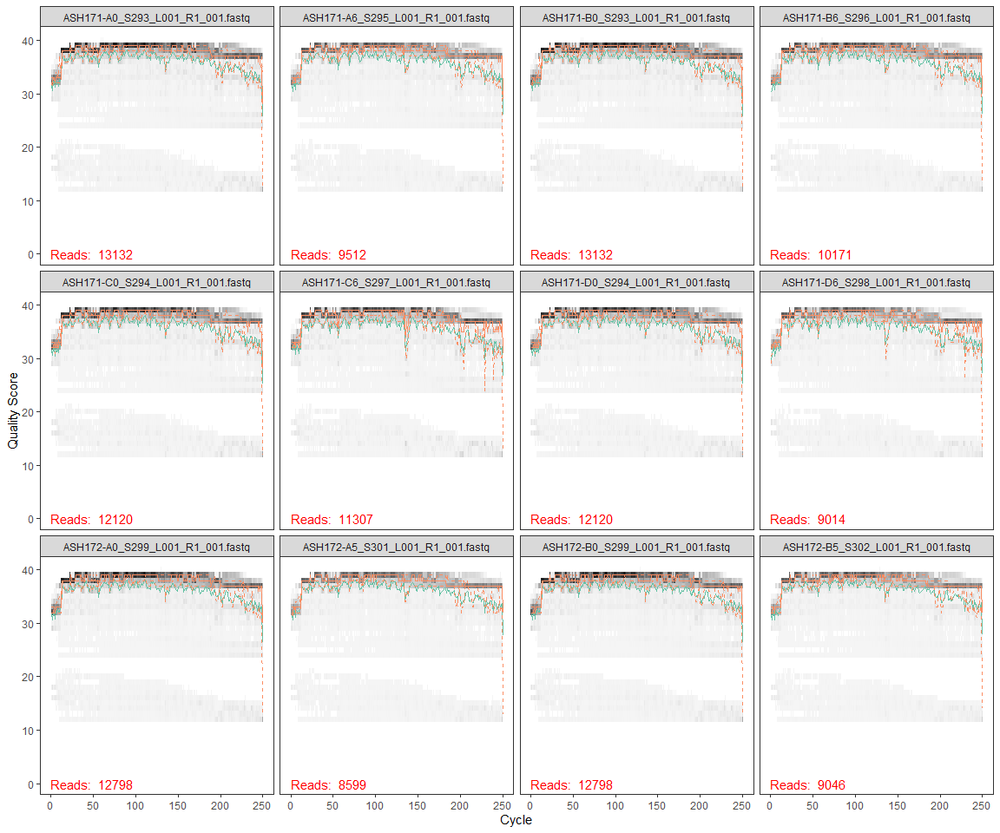
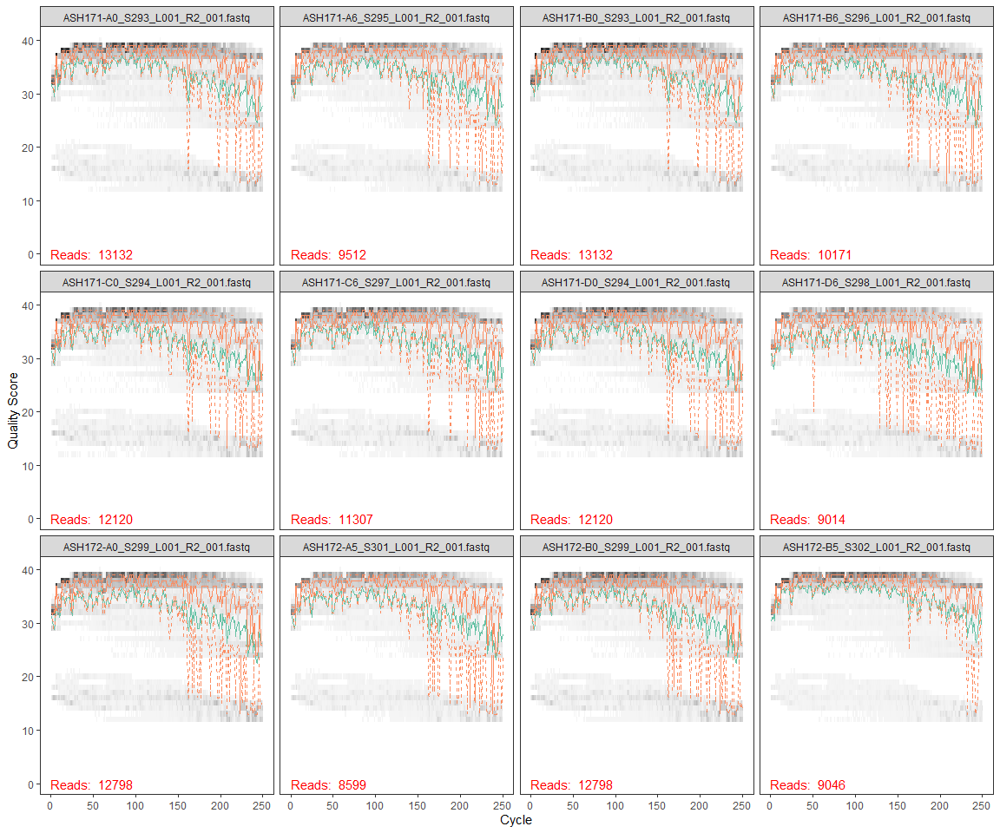
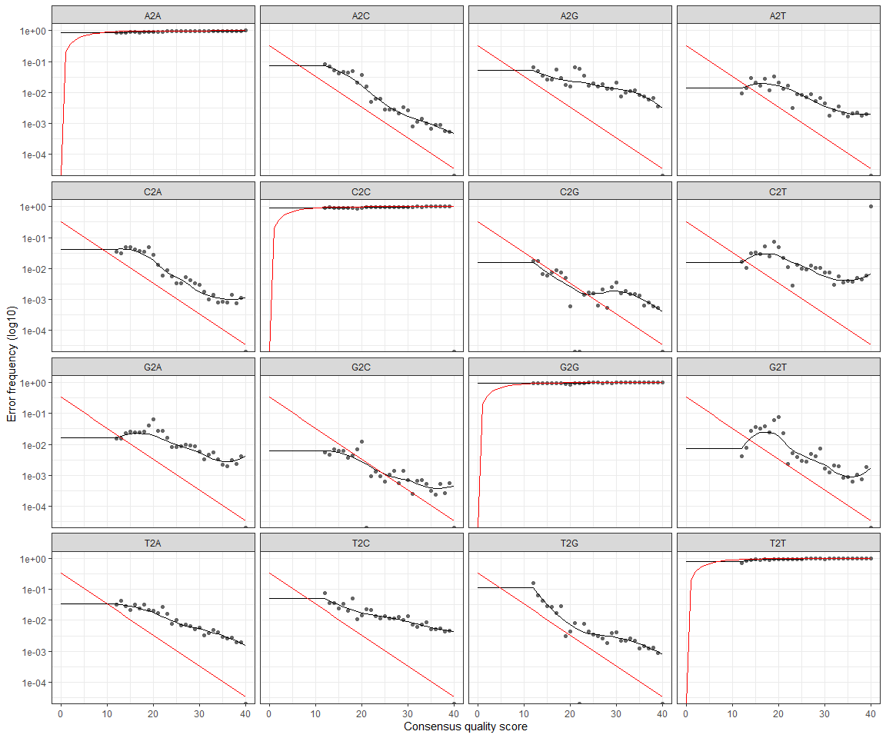
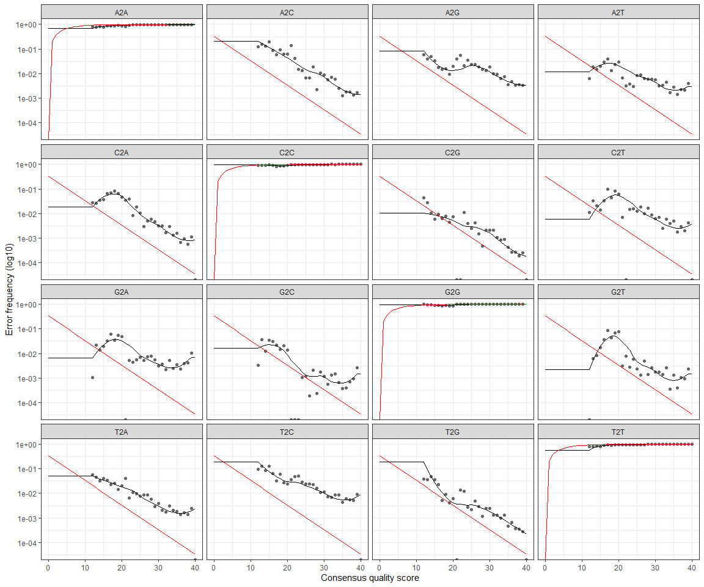

DADA2
================
Melvin Lin
11/7/2020

# Install and Load DADA2 and ShortRead from Bioconductor

``` r
#install.packages("devtools")
#library("devtools")
#devtools::install_github("benjjneb/dada2", ref="v1.16")
```

``` r
#library("devtools")
#devtools::install_github("benjjneb/dada2")
```

``` r
library(dada2)
```

    ## Loading required package: Rcpp

``` r
library(ShortRead)
```

    ## Loading required package: BiocGenerics

    ## Loading required package: parallel

    ## 
    ## Attaching package: 'BiocGenerics'

    ## The following objects are masked from 'package:parallel':
    ## 
    ##     clusterApply, clusterApplyLB, clusterCall, clusterEvalQ,
    ##     clusterExport, clusterMap, parApply, parCapply, parLapply,
    ##     parLapplyLB, parRapply, parSapply, parSapplyLB

    ## The following objects are masked from 'package:stats':
    ## 
    ##     IQR, mad, sd, var, xtabs

    ## The following objects are masked from 'package:base':
    ## 
    ##     anyDuplicated, append, as.data.frame, basename, cbind, colnames,
    ##     dirname, do.call, duplicated, eval, evalq, Filter, Find, get, grep,
    ##     grepl, intersect, is.unsorted, lapply, Map, mapply, match, mget,
    ##     order, paste, pmax, pmax.int, pmin, pmin.int, Position, rank,
    ##     rbind, Reduce, rownames, sapply, setdiff, sort, table, tapply,
    ##     union, unique, unsplit, which.max, which.min

    ## Loading required package: BiocParallel

    ## Loading required package: Biostrings

    ## Loading required package: S4Vectors

    ## Loading required package: stats4

    ## 
    ## Attaching package: 'S4Vectors'

    ## The following object is masked from 'package:base':
    ## 
    ##     expand.grid

    ## Loading required package: IRanges

    ## 
    ## Attaching package: 'IRanges'

    ## The following object is masked from 'package:grDevices':
    ## 
    ##     windows

    ## Loading required package: XVector

    ## 
    ## Attaching package: 'Biostrings'

    ## The following object is masked from 'package:base':
    ## 
    ##     strsplit

    ## Loading required package: Rsamtools

    ## Loading required package: GenomeInfoDb

    ## Loading required package: GenomicRanges

    ## Loading required package: GenomicAlignments

    ## Loading required package: SummarizedExperiment

    ## Loading required package: MatrixGenerics

    ## Loading required package: matrixStats

    ## 
    ## Attaching package: 'MatrixGenerics'

    ## The following objects are masked from 'package:matrixStats':
    ## 
    ##     colAlls, colAnyNAs, colAnys, colAvgsPerRowSet, colCollapse,
    ##     colCounts, colCummaxs, colCummins, colCumprods, colCumsums,
    ##     colDiffs, colIQRDiffs, colIQRs, colLogSumExps, colMadDiffs,
    ##     colMads, colMaxs, colMeans2, colMedians, colMins, colOrderStats,
    ##     colProds, colQuantiles, colRanges, colRanks, colSdDiffs, colSds,
    ##     colSums2, colTabulates, colVarDiffs, colVars, colWeightedMads,
    ##     colWeightedMeans, colWeightedMedians, colWeightedSds,
    ##     colWeightedVars, rowAlls, rowAnyNAs, rowAnys, rowAvgsPerColSet,
    ##     rowCollapse, rowCounts, rowCummaxs, rowCummins, rowCumprods,
    ##     rowCumsums, rowDiffs, rowIQRDiffs, rowIQRs, rowLogSumExps,
    ##     rowMadDiffs, rowMads, rowMaxs, rowMeans2, rowMedians, rowMins,
    ##     rowOrderStats, rowProds, rowQuantiles, rowRanges, rowRanks,
    ##     rowSdDiffs, rowSds, rowSums2, rowTabulates, rowVarDiffs, rowVars,
    ##     rowWeightedMads, rowWeightedMeans, rowWeightedMedians,
    ##     rowWeightedSds, rowWeightedVars

    ## Loading required package: Biobase

    ## Welcome to Bioconductor
    ## 
    ##     Vignettes contain introductory material; view with
    ##     'browseVignettes()'. To cite Bioconductor, see
    ##     'citation("Biobase")', and for packages 'citation("pkgname")'.

    ## 
    ## Attaching package: 'Biobase'

    ## The following object is masked from 'package:MatrixGenerics':
    ## 
    ##     rowMedians

    ## The following objects are masked from 'package:matrixStats':
    ## 
    ##     anyMissing, rowMedians

``` r
# install.packages("dplyr")
# install.packages("tidyverse")
library(tidyverse)
```

    ## -- Attaching packages --------------------------------------- tidyverse 1.3.0 --

    ## v ggplot2 3.3.2     v purrr   0.3.4
    ## v tibble  3.0.4     v dplyr   1.0.2
    ## v tidyr   1.1.2     v stringr 1.4.0
    ## v readr   1.4.0     v forcats 0.5.0

    ## -- Conflicts ------------------------------------------ tidyverse_conflicts() --
    ## x dplyr::collapse()   masks Biostrings::collapse(), IRanges::collapse()
    ## x dplyr::combine()    masks Biobase::combine(), BiocGenerics::combine()
    ## x purrr::compact()    masks XVector::compact()
    ## x purrr::compose()    masks ShortRead::compose()
    ## x dplyr::count()      masks matrixStats::count()
    ## x dplyr::desc()       masks IRanges::desc()
    ## x tidyr::expand()     masks S4Vectors::expand()
    ## x dplyr::filter()     masks stats::filter()
    ## x dplyr::first()      masks GenomicAlignments::first(), S4Vectors::first()
    ## x dplyr::id()         masks ShortRead::id()
    ## x dplyr::lag()        masks stats::lag()
    ## x dplyr::last()       masks GenomicAlignments::last()
    ## x ggplot2::Position() masks BiocGenerics::Position(), base::Position()
    ## x purrr::reduce()     masks GenomicRanges::reduce(), IRanges::reduce()
    ## x dplyr::rename()     masks S4Vectors::rename()
    ## x dplyr::slice()      masks XVector::slice(), IRanges::slice()
    ## x tibble::view()      masks ShortRead::view()

``` r
path <- "~/GITHUB/144l_students/Input_Data/week5/ACIDD_Remin_fastq/"

#store the names of the forward and rev files as lists

fnFs <- list.files(path, pattern = "_R1_001.fastq", full.names = TRUE)
fnRs <- list.files(path, pattern = "_R2_001.fastq", full.names = TRUE)
```

# Retrieve orientation of primers

The primers targeted the V4 region and are known 514F-Y and 806RB
primers

``` r
#store the forward and reverse primers
FWD = "GTGYCAGCMGCCGCGGTAA"
REV = "GGACTACNVGGGTWTCTAAT"

# now store all orientations of forward and reverse primers
allOrients <- function(primer) {
  # The Biostrings work w/ DNAstring objects rather than character vectors
  require(Biostrings)
  dna <- DNAString(primer)
  orients <- c(Forward = dna, Complement = complement(dna), Reverse = reverse(dna),
               RevComp = reverseComplement(dna))
  return(sapply(orients, toString))
}

#store the fwd and reverse orientations separately 
FWD.orients <- allOrients(FWD)
REV.orients <- allOrients(REV)

#view the orientations of the primers
FWD.orients
```

    ##               Forward            Complement               Reverse 
    ## "GTGYCAGCMGCCGCGGTAA" "CACRGTCGKCGGCGCCATT" "AATGGCGCCGMCGACYGTG" 
    ##               RevComp 
    ## "TTACCGCGGCKGCTGRCAC"

``` r
REV.orients
```

    ##                Forward             Complement                Reverse 
    ## "GGACTACNVGGGTWTCTAAT" "CCTGATGNBCCCAWAGATTA" "TAATCTWTGGGVNCATCAGG" 
    ##                RevComp 
    ## "ATTAGAWACCCBNGTAGTCC"

# Search for Primers

``` r
primerHits <- function(primer, fn) {
  # Counts number of reads in which the primer is found
  nhits <- vcountPattern(primer, sread(readFastq(fn)), fixed = FALSE)
  return(sum(nhits > 0))
}

rbind(FWD.ForwardReads = sapply(FWD.orients, primerHits, fn = fnFs[[1]]),
      FWD.ReverseReads = sapply(FWD.orients, primerHits, fn = fnFs[[1]]),
      REV.ForwardReads = sapply(FWD.orients, primerHits, fn = fnFs[[1]]),
      REV.ReverseReads = sapply(FWD.orients, primerHits, fn = fnFs[[1]]))
```

    ##                  Forward Complement Reverse RevComp
    ## FWD.ForwardReads       0          0       0       0
    ## FWD.ReverseReads       0          0       0       0
    ## REV.ForwardReads       0          0       0       0
    ## REV.ReverseReads       0          0       0       0

At this point a 4x4 table is returned. If all numbers are 0, then you
don’t have primers in your sequence. If they have numbers, use cutadept
to remove the primers.

# Inspect read quality profiles

You should look at at least some of the quality profiles to assess the
quality of the sequencing rn.

## Forward reads

``` r
plotQualityProfile((fnFs[1:12]))
```

<!-- -->

## Reverse reads

``` r
plotQualityProfile(fnRs[1:12])
```

<!-- -->

# Filtering and Trimming

``` r
#Get the sample names
#define the basename of the FnFs as the first part of each fastQ file name until "_L"
#apply this to all samples
sample.names <- sapply(strsplit(basename(fnFs), "_L"), `[`, 1)
sample.names
```

    ##  [1] "ASH171-A0_S293" "ASH171-A6_S295" "ASH171-B0_S293" "ASH171-B6_S296"
    ##  [5] "ASH171-C0_S294" "ASH171-C6_S297" "ASH171-D0_S294" "ASH171-D6_S298"
    ##  [9] "ASH172-A0_S299" "ASH172-A5_S301" "ASH172-B0_S299" "ASH172-B5_S302"
    ## [13] "ASH172-C0_S300" "ASH172-C5_S303" "ASH172-D0_S300" "ASH172-D5_S304"

``` r
#create a "filtered" folder in the working directory as a place to put all new filtered fastQ files
filt_path <- file.path(path,"filtered")
#add the appropriate designation string to any new files made that will be put into the "filtered" folder
filtFs <- file.path(filt_path, paste0(sample.names, "_F_filt.fastq"))
filtRs <- file.path(filt_path, paste0(sample.names, "_R_filt.fastq"))
```

``` r
out <- filterAndTrim(fnFs, filtFs, fnRs, filtRs, truncLen = c(240,150), maxN = 0, maxEE = c(2,2), truncQ = 2, rm.phix = TRUE, compress = TRUE)
#look at the output. this tells you how many reads were removed
out
```

    ##                                  reads.in reads.out
    ## ASH171-A0_S293_L001_R1_001.fastq    13132     12306
    ## ASH171-A6_S295_L001_R1_001.fastq     9512      8807
    ## ASH171-B0_S293_L001_R1_001.fastq    13132     12306
    ## ASH171-B6_S296_L001_R1_001.fastq    10171      9494
    ## ASH171-C0_S294_L001_R1_001.fastq    12120     11231
    ## ASH171-C6_S297_L001_R1_001.fastq    11307     10310
    ## ASH171-D0_S294_L001_R1_001.fastq    12120     11231
    ## ASH171-D6_S298_L001_R1_001.fastq     9014      8211
    ## ASH172-A0_S299_L001_R1_001.fastq    12798     11824
    ## ASH172-A5_S301_L001_R1_001.fastq     8599      7988
    ## ASH172-B0_S299_L001_R1_001.fastq    12798     11824
    ## ASH172-B5_S302_L001_R1_001.fastq     9046      8624
    ## ASH172-C0_S300_L001_R1_001.fastq    11371     10559
    ## ASH172-C5_S303_L001_R1_001.fastq     9621      9127
    ## ASH172-D0_S300_L001_R1_001.fastq    11371     10559
    ## ASH172-D5_S304_L001_R1_001.fastq     7081      6759

\#Learn the error rates

``` r
errF <- learnErrors(filtFs, multithread = TRUE)
```

    ## 38678400 total bases in 161160 reads from 16 samples will be used for learning the error rates.

``` r
errR <- learnErrors(filtRs, multithread = TRUE)
```

    ## 24174000 total bases in 161160 reads from 16 samples will be used for learning the error rates.





\#Dereplication

Dada2 combines all identical sequences into one unique sequence, keeping
track of the number of identical sequences

``` r
derepFs <- derepFastq(filtFs, verbose = TRUE)
```

    ## Dereplicating sequence entries in Fastq file: ~/GITHUB/144l_students/Input_Data/week5/ACIDD_Remin_fastq//filtered/ASH171-A0_S293_F_filt.fastq

    ## Encountered 7405 unique sequences from 12306 total sequences read.

    ## Dereplicating sequence entries in Fastq file: ~/GITHUB/144l_students/Input_Data/week5/ACIDD_Remin_fastq//filtered/ASH171-A6_S295_F_filt.fastq

    ## Encountered 5227 unique sequences from 8807 total sequences read.

    ## Dereplicating sequence entries in Fastq file: ~/GITHUB/144l_students/Input_Data/week5/ACIDD_Remin_fastq//filtered/ASH171-B0_S293_F_filt.fastq

    ## Encountered 7405 unique sequences from 12306 total sequences read.

    ## Dereplicating sequence entries in Fastq file: ~/GITHUB/144l_students/Input_Data/week5/ACIDD_Remin_fastq//filtered/ASH171-B6_S296_F_filt.fastq

    ## Encountered 5556 unique sequences from 9494 total sequences read.

    ## Dereplicating sequence entries in Fastq file: ~/GITHUB/144l_students/Input_Data/week5/ACIDD_Remin_fastq//filtered/ASH171-C0_S294_F_filt.fastq

    ## Encountered 6358 unique sequences from 11231 total sequences read.

    ## Dereplicating sequence entries in Fastq file: ~/GITHUB/144l_students/Input_Data/week5/ACIDD_Remin_fastq//filtered/ASH171-C6_S297_F_filt.fastq

    ## Encountered 5448 unique sequences from 10310 total sequences read.

    ## Dereplicating sequence entries in Fastq file: ~/GITHUB/144l_students/Input_Data/week5/ACIDD_Remin_fastq//filtered/ASH171-D0_S294_F_filt.fastq

    ## Encountered 6358 unique sequences from 11231 total sequences read.

    ## Dereplicating sequence entries in Fastq file: ~/GITHUB/144l_students/Input_Data/week5/ACIDD_Remin_fastq//filtered/ASH171-D6_S298_F_filt.fastq

    ## Encountered 4235 unique sequences from 8211 total sequences read.

    ## Dereplicating sequence entries in Fastq file: ~/GITHUB/144l_students/Input_Data/week5/ACIDD_Remin_fastq//filtered/ASH172-A0_S299_F_filt.fastq

    ## Encountered 7240 unique sequences from 11824 total sequences read.

    ## Dereplicating sequence entries in Fastq file: ~/GITHUB/144l_students/Input_Data/week5/ACIDD_Remin_fastq//filtered/ASH172-A5_S301_F_filt.fastq

    ## Encountered 4816 unique sequences from 7988 total sequences read.

    ## Dereplicating sequence entries in Fastq file: ~/GITHUB/144l_students/Input_Data/week5/ACIDD_Remin_fastq//filtered/ASH172-B0_S299_F_filt.fastq

    ## Encountered 7240 unique sequences from 11824 total sequences read.

    ## Dereplicating sequence entries in Fastq file: ~/GITHUB/144l_students/Input_Data/week5/ACIDD_Remin_fastq//filtered/ASH172-B5_S302_F_filt.fastq

    ## Encountered 4735 unique sequences from 8624 total sequences read.

    ## Dereplicating sequence entries in Fastq file: ~/GITHUB/144l_students/Input_Data/week5/ACIDD_Remin_fastq//filtered/ASH172-C0_S300_F_filt.fastq

    ## Encountered 6642 unique sequences from 10559 total sequences read.

    ## Dereplicating sequence entries in Fastq file: ~/GITHUB/144l_students/Input_Data/week5/ACIDD_Remin_fastq//filtered/ASH172-C5_S303_F_filt.fastq

    ## Encountered 4862 unique sequences from 9127 total sequences read.

    ## Dereplicating sequence entries in Fastq file: ~/GITHUB/144l_students/Input_Data/week5/ACIDD_Remin_fastq//filtered/ASH172-D0_S300_F_filt.fastq

    ## Encountered 6642 unique sequences from 10559 total sequences read.

    ## Dereplicating sequence entries in Fastq file: ~/GITHUB/144l_students/Input_Data/week5/ACIDD_Remin_fastq//filtered/ASH172-D5_S304_F_filt.fastq

    ## Encountered 3657 unique sequences from 6759 total sequences read.

``` r
derepRs <- derepFastq(filtRs, verbose = TRUE)
```

    ## Dereplicating sequence entries in Fastq file: ~/GITHUB/144l_students/Input_Data/week5/ACIDD_Remin_fastq//filtered/ASH171-A0_S293_R_filt.fastq

    ## Encountered 6257 unique sequences from 12306 total sequences read.

    ## Dereplicating sequence entries in Fastq file: ~/GITHUB/144l_students/Input_Data/week5/ACIDD_Remin_fastq//filtered/ASH171-A6_S295_R_filt.fastq

    ## Encountered 4706 unique sequences from 8807 total sequences read.

    ## Dereplicating sequence entries in Fastq file: ~/GITHUB/144l_students/Input_Data/week5/ACIDD_Remin_fastq//filtered/ASH171-B0_S293_R_filt.fastq

    ## Encountered 6257 unique sequences from 12306 total sequences read.

    ## Dereplicating sequence entries in Fastq file: ~/GITHUB/144l_students/Input_Data/week5/ACIDD_Remin_fastq//filtered/ASH171-B6_S296_R_filt.fastq

    ## Encountered 5092 unique sequences from 9494 total sequences read.

    ## Dereplicating sequence entries in Fastq file: ~/GITHUB/144l_students/Input_Data/week5/ACIDD_Remin_fastq//filtered/ASH171-C0_S294_R_filt.fastq

    ## Encountered 5887 unique sequences from 11231 total sequences read.

    ## Dereplicating sequence entries in Fastq file: ~/GITHUB/144l_students/Input_Data/week5/ACIDD_Remin_fastq//filtered/ASH171-C6_S297_R_filt.fastq

    ## Encountered 4891 unique sequences from 10310 total sequences read.

    ## Dereplicating sequence entries in Fastq file: ~/GITHUB/144l_students/Input_Data/week5/ACIDD_Remin_fastq//filtered/ASH171-D0_S294_R_filt.fastq

    ## Encountered 5887 unique sequences from 11231 total sequences read.

    ## Dereplicating sequence entries in Fastq file: ~/GITHUB/144l_students/Input_Data/week5/ACIDD_Remin_fastq//filtered/ASH171-D6_S298_R_filt.fastq

    ## Encountered 4353 unique sequences from 8211 total sequences read.

    ## Dereplicating sequence entries in Fastq file: ~/GITHUB/144l_students/Input_Data/week5/ACIDD_Remin_fastq//filtered/ASH172-A0_S299_R_filt.fastq

    ## Encountered 6844 unique sequences from 11824 total sequences read.

    ## Dereplicating sequence entries in Fastq file: ~/GITHUB/144l_students/Input_Data/week5/ACIDD_Remin_fastq//filtered/ASH172-A5_S301_R_filt.fastq

    ## Encountered 4617 unique sequences from 7988 total sequences read.

    ## Dereplicating sequence entries in Fastq file: ~/GITHUB/144l_students/Input_Data/week5/ACIDD_Remin_fastq//filtered/ASH172-B0_S299_R_filt.fastq

    ## Encountered 6844 unique sequences from 11824 total sequences read.

    ## Dereplicating sequence entries in Fastq file: ~/GITHUB/144l_students/Input_Data/week5/ACIDD_Remin_fastq//filtered/ASH172-B5_S302_R_filt.fastq

    ## Encountered 3596 unique sequences from 8624 total sequences read.

    ## Dereplicating sequence entries in Fastq file: ~/GITHUB/144l_students/Input_Data/week5/ACIDD_Remin_fastq//filtered/ASH172-C0_S300_R_filt.fastq

    ## Encountered 6625 unique sequences from 10559 total sequences read.

    ## Dereplicating sequence entries in Fastq file: ~/GITHUB/144l_students/Input_Data/week5/ACIDD_Remin_fastq//filtered/ASH172-C5_S303_R_filt.fastq

    ## Encountered 3582 unique sequences from 9127 total sequences read.

    ## Dereplicating sequence entries in Fastq file: ~/GITHUB/144l_students/Input_Data/week5/ACIDD_Remin_fastq//filtered/ASH172-D0_S300_R_filt.fastq

    ## Encountered 6625 unique sequences from 10559 total sequences read.

    ## Dereplicating sequence entries in Fastq file: ~/GITHUB/144l_students/Input_Data/week5/ACIDD_Remin_fastq//filtered/ASH172-D5_S304_R_filt.fastq

    ## Encountered 2688 unique sequences from 6759 total sequences read.

``` r
# Name the derep-class objects by the sample names
names(derepFs) <- sample.names
names(derepRs) <- sample.names
```

# Infer the sequence variants

Apply the core dada2 sample inference algorithm to the dereplicated
data.

Infer the sequence variants in each sample, taking out the sequence
variants that have excessive error rates.

``` r
dadaFs <- dada(derepFs, err = errF, multithread = TRUE)
```

    ## Sample 1 - 12306 reads in 7405 unique sequences.
    ## Sample 2 - 8807 reads in 5227 unique sequences.
    ## Sample 3 - 12306 reads in 7405 unique sequences.
    ## Sample 4 - 9494 reads in 5556 unique sequences.
    ## Sample 5 - 11231 reads in 6358 unique sequences.
    ## Sample 6 - 10310 reads in 5448 unique sequences.
    ## Sample 7 - 11231 reads in 6358 unique sequences.
    ## Sample 8 - 8211 reads in 4235 unique sequences.
    ## Sample 9 - 11824 reads in 7240 unique sequences.
    ## Sample 10 - 7988 reads in 4816 unique sequences.
    ## Sample 11 - 11824 reads in 7240 unique sequences.
    ## Sample 12 - 8624 reads in 4735 unique sequences.
    ## Sample 13 - 10559 reads in 6642 unique sequences.
    ## Sample 14 - 9127 reads in 4862 unique sequences.
    ## Sample 15 - 10559 reads in 6642 unique sequences.
    ## Sample 16 - 6759 reads in 3657 unique sequences.

``` r
dadaRs <- dada(derepRs, err = errR, multithread = TRUE)
```

    ## Sample 1 - 12306 reads in 6257 unique sequences.
    ## Sample 2 - 8807 reads in 4706 unique sequences.
    ## Sample 3 - 12306 reads in 6257 unique sequences.
    ## Sample 4 - 9494 reads in 5092 unique sequences.
    ## Sample 5 - 11231 reads in 5887 unique sequences.
    ## Sample 6 - 10310 reads in 4891 unique sequences.
    ## Sample 7 - 11231 reads in 5887 unique sequences.
    ## Sample 8 - 8211 reads in 4353 unique sequences.
    ## Sample 9 - 11824 reads in 6844 unique sequences.
    ## Sample 10 - 7988 reads in 4617 unique sequences.
    ## Sample 11 - 11824 reads in 6844 unique sequences.
    ## Sample 12 - 8624 reads in 3596 unique sequences.
    ## Sample 13 - 10559 reads in 6625 unique sequences.
    ## Sample 14 - 9127 reads in 3582 unique sequences.
    ## Sample 15 - 10559 reads in 6625 unique sequences.
    ## Sample 16 - 6759 reads in 2688 unique sequences.

merge the overlapping reads -\> this will also decrease the number of
sequence variants.

``` r
mergers <- mergePairs(dadaFs, derepFs, dadaRs, derepRs, verbose = TRUE, trimOverhang = T)
```

    ## 10646 paired-reads (in 99 unique pairings) successfully merged out of 11907 (in 205 pairings) input.

    ## 7785 paired-reads (in 65 unique pairings) successfully merged out of 8471 (in 161 pairings) input.

    ## 10646 paired-reads (in 99 unique pairings) successfully merged out of 11907 (in 205 pairings) input.

    ## 8427 paired-reads (in 76 unique pairings) successfully merged out of 9145 (in 167 pairings) input.

    ## 9578 paired-reads (in 86 unique pairings) successfully merged out of 10900 (in 220 pairings) input.

    ## 9579 paired-reads (in 61 unique pairings) successfully merged out of 10074 (in 146 pairings) input.

    ## 9578 paired-reads (in 86 unique pairings) successfully merged out of 10900 (in 220 pairings) input.

    ## 7710 paired-reads (in 42 unique pairings) successfully merged out of 8037 (in 106 pairings) input.

    ## 10854 paired-reads (in 101 unique pairings) successfully merged out of 11485 (in 209 pairings) input.

    ## 7435 paired-reads (in 72 unique pairings) successfully merged out of 7737 (in 151 pairings) input.

    ## 10854 paired-reads (in 101 unique pairings) successfully merged out of 11485 (in 209 pairings) input.

    ## 7945 paired-reads (in 74 unique pairings) successfully merged out of 8375 (in 151 pairings) input.

    ## 9357 paired-reads (in 100 unique pairings) successfully merged out of 10224 (in 216 pairings) input.

    ## 8643 paired-reads (in 60 unique pairings) successfully merged out of 8900 (in 109 pairings) input.

    ## 9357 paired-reads (in 100 unique pairings) successfully merged out of 10224 (in 216 pairings) input.

    ## 6388 paired-reads (in 59 unique pairings) successfully merged out of 6591 (in 93 pairings) input.

inspect the merged data frame from the first sample. This will output a
table. the numbers in the forward and reverse columns tell where those
sequences are in the dadaFs and dadaRs files. nmatch is how many bases
matched. we uniformly trimmed the amplicons so they should all be the
same.

``` r
head(mergers[[1]])
```

    ##                                                                                                                                                                                                                                                        sequence
    ## 1 TACGGGAGTGGCAAGCGTTATCCGGAATTATTGGGCGTAAAGCGTCCGCAGGCGGCCTTTCAAGTCTGCTGTTAAAGCGTGGAGCTTAACTCCATTATGGCAGTGGAAACTGATCGGCTTGAGTATGGTAGGGGCAGAGGGAATTCCCGGTGTAGCGGTGAAATGCGTAGATATCGGGAAGAACACCAGTGGCGAAGGCGCTCTGCTGGGCCATTACTGACGCTCATGGACGAAAGCCAGGGGAGCGAAAGGG
    ## 2 TACGAAGGGACCTAGCGTAGTTCGGAATTACTGGGCTTAAAGAGTTCGTAGGTGGTTGAAAAAGTTGGTGGTGAAATCCCAGAGCTTAACTCTGGAACTGCCATCAAAACTTTTCAGCTAGAGTATGATAGAGGAAAGCAGAATTTCTAGTGTAGAGGTGAAATTCGTAGATATTAGAAAGAATACCAATTGCGAAGGCAGCTTTCTGGATCATTACTGACACTGAGGAACGAAAGCATGGGTAGCGAAGAGG
    ## 3 TACGAAGGGACCTAGCGTAGTTCGGAATTACTGGGCTTAAAGAGTTCGTAGGTGGTTGAAAAAGTTGGTGGTGAAATCCCAGAGCTTAACTCTGGAACTGCCATCAAAACTTTTCAGCTAGAGTTTGATAGAGGAAAGCAGAATTTCTAGTGTAGAGGTGAAATTCGTAGATATTAGAAAGAATACCAATTGCGAAGGCAGCTTTCTGGATCATTACTGACACTGAGGAACGAAAGCATGGGTAGCGAAGAGG
    ## 4 TACGGGAGTGGCAAGCGTTATCCGGAATTATTGGGCGTAAAGCGTCCGCAGGCGGCCTTTCAAGTCTGCTGTTAAAGCGTGGAGCTTAACTCCATCATGGCAGTGGAAACTGATCGGCTTGAGTATGGTAGGGGCAGAGGGAATTCCCGGTGTAGCGGTGAAATGCGTAGATATCGGGAAGAACACCAGTGGCGAAGGCGCTCTGCTGGGCCATTACTGACGCTCATGGACGAAAGCCAGGGGAGCGAAAGGG
    ## 5 TACGAAGGGACCTAGCGTAGTTCGGAATTACTGGGCTTAAAGAGCTCGTAGGTGGTTAAAAAAGTTGATGGTGAAATCCCAAGGCTCAACCTTGGAACTGCCATCAAAACTTTTTAGCTAGAGTGTGATAGAGGTAAGTGGAATTTCTAGTGTAGAGGTGAAATTCGTAGATATTAGAAAGAACACCAAATGCGAAGGCAACTTACTGGGTCACTACTGACACTGAGGAGCGAAAGCATGGGTAGCGAAGAGG
    ## 6 TACGAAGGGACCTAGCGTAGTTCGGAATTACTGGGCTTAAAGAGTTCGTAGGTGGTTGAAAAAGTTAGTGGTGAAATCCCAGAGCTTAACTCTGGAACTGCCATTAAAACTTTTCAGCTAGAGTATGATAGAGGAAAGCAGAATTTCTAGTGTAGAGGTGAAATTCGTAGATATTAGAAAGAATACCAATTGCGAAGGCAGCTTTCTGGATCATTACTGACACTGAGGAACGAAAGCATGGGTAGCGAAGAGG
    ##   abundance forward reverse nmatch nmismatch nindel prefer accept
    ## 1      1906       1       1    137         0      0      2   TRUE
    ## 2      1010       2       2    137         0      0      2   TRUE
    ## 3       903       3       3    137         0      0      2   TRUE
    ## 4       502      62       1    137         0      0      2   TRUE
    ## 5       497       4       4    137         0      0      2   TRUE
    ## 6       400       5      51    137         0      0      2   TRUE

save the unassigned merged reads

``` r
saveRDS(mergers, "~/GITHUB/144l_students/Output_Data/week5/dada_merged.rds")
saveRDS(mergers, "~/GITHUB/144l_students/Input_Data/week6/dada_merged.rds")
```

construct a sequence table of our samples that is analagous to the “OTU
table” produced by classical methods

``` r
seqtab <- makeSequenceTable(mergers)
dim(seqtab) #samples by unique sequences
```

    ## [1]  16 280

check the distribution of the sequence lengths

``` r
table(nchar(getSequences(seqtab)))
```

    ## 
    ## 229 252 253 254 258 
    ##   1   2 267   9   1

# Remove the Chimeras

in PCR, two or more biological sequences can attach to each other and
then polymerase builds a non-biological sequence. Weird. These are are
artifacts that need to be removed

``` r
seqtab.nochim <- removeBimeraDenovo(seqtab, verbose = TRUE)
```

    ## Identified 6 bimeras out of 280 input sequences.

``` r
dim(seqtab.nochim)
```

    ## [1]  16 274

check the proportion of sequences that are not chimeras

``` r
sum(seqtab.nochim)/sum(seqtab)
```

    ## [1] 0.9985634

# Assign taxonomy using a reference database

here we are referencing the Silva database

``` r
taxa <- assignTaxonomy(seqtab.nochim, "~/GITHUB/144l_students/Input_Data/week5/Reference_Database/silva_nr_v138_train_set.fa", multithread = TRUE)
```

Create a table out of the taxa data (one with the sequences and
assignments, one with just all the taxa)

these are the tables you want to save

``` r
saveRDS(t(seqtab.nochim), "~/GITHUB/144l_students/Output_Data/week5/seqtab-nochimtaxa123.rds")
saveRDS(taxa, "~/GITHUB/144l_students/Output_Data/week5/taxa123.rds")

saveRDS(t(seqtab.nochim), "~/GITHUB/144l_students/Input_Data/week6/seqtab-nochimtaxa123.rds")
saveRDS(taxa, "~/GITHUB/144l_students/Input_Data/week6/taxa123.rds")
```
