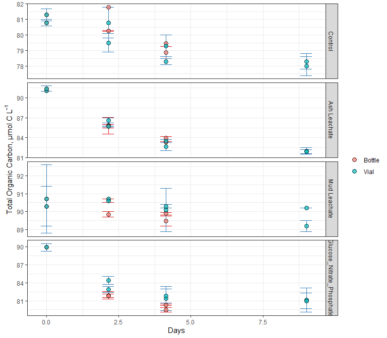
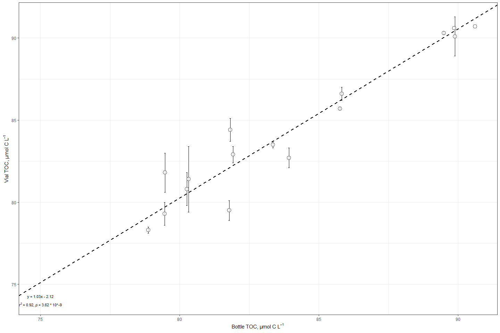
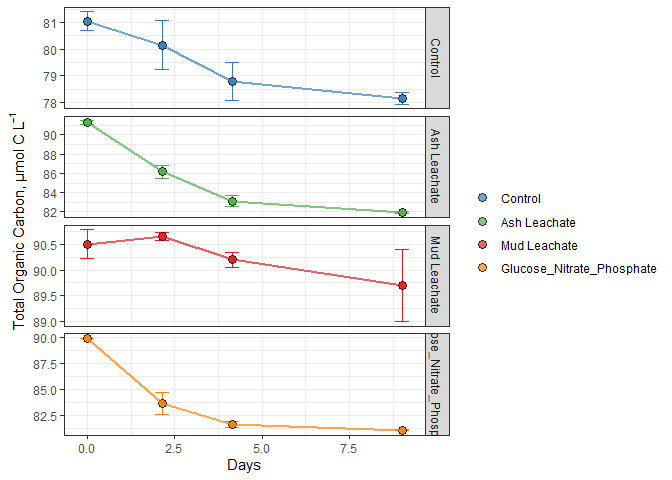
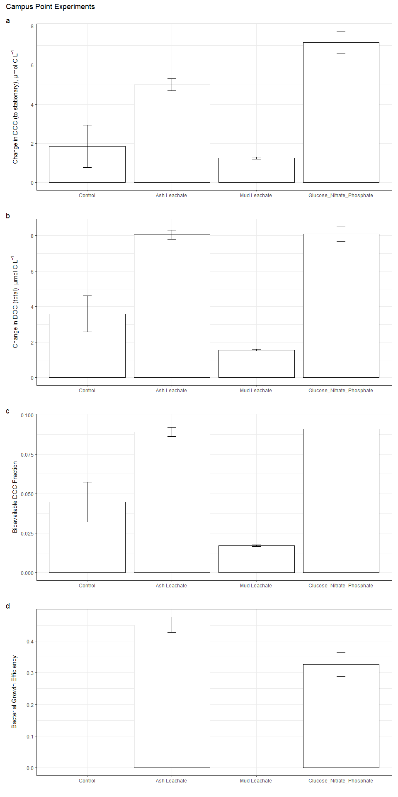

TOC/DOC Analysis
================
Melvin Lin
11/5/2020

``` r
library(tidyverse)
library(readxl)
library(lubridate)
```

# Import Data

``` r
excel_sheets("~/GITHUB/144l_students/Input_Data/week4/144L_2018_Exp_TOC.xlsx")
```

    ## [1] "Metadata" "Data"

``` r
metadata1 <- read_excel("~/GITHUB/144l_students/Input_Data/week4/144L_2018_Exp_TOC.xlsx", sheet = "Metadata")

data1 <- read_excel("~/GITHUB/144l_students/Input_Data/week4/144L_2018_Exp_TOC.xlsx", sheet = "Data")
```

``` r
glimpse(metadata1)
```

    ## Rows: 80
    ## Columns: 16
    ## $ Experiment           <chr> "144L_2018", "144L_2018", "144L_2018", "144L_2...
    ## $ Location             <chr> "Campus Point", "Campus Point", "Campus Point"...
    ## $ Temperature          <dbl> 20, 20, 20, 20, 20, 20, 20, 20, 20, 20, 20, 20...
    ## $ Depth                <dbl> 1, 1, 1, 1, 1, 1, 1, 1, 1, 1, 1, 1, 1, 1, 1, 1...
    ## $ Bottle               <chr> "A", "A", "A", "A", "A", "A", "A", "A", "A", "...
    ## $ Timepoint            <dbl> 0, 1, 2, 3, 4, 5, 6, 7, 8, 9, 0, 1, 2, 3, 4, 5...
    ## $ Treatment            <chr> "Control", "Control", "Control", "Control", "C...
    ## $ Target_DOC_Amendment <dbl> 0, 0, 0, 0, 0, 0, 0, 0, 0, 0, 0, 0, 0, 0, 0, 0...
    ## $ Inoculum_L           <dbl> 1.5, 1.5, 1.5, 1.5, 1.5, 1.5, 1.5, 1.5, 1.5, 1...
    ## $ Media_L              <dbl> 3.5, 3.5, 3.5, 3.5, 3.5, 3.5, 3.5, 3.5, 3.5, 3...
    ## $ Datetime             <chr> "2018-10-15T16:30", "2018-10-16T08:00", "2018-...
    ## $ TOC_Sample           <lgl> TRUE, FALSE, FALSE, FALSE, TRUE, FALSE, FALSE,...
    ## $ Parallel_Sample      <lgl> TRUE, FALSE, FALSE, FALSE, TRUE, FALSE, FALSE,...
    ## $ Cell_Sample          <lgl> TRUE, TRUE, TRUE, TRUE, TRUE, TRUE, TRUE, TRUE...
    ## $ DNA_Sample           <lgl> TRUE, FALSE, FALSE, FALSE, TRUE, FALSE, FALSE,...
    ## $ DNA_SampleID         <chr> "144_A0_S6", NA, NA, NA, "144_A4_S7", NA, NA, ...

``` r
glimpse(data1)
```

    ## Rows: 32
    ## Columns: 6
    ## $ Bottle    <chr> "A", "A", "A", "A", "B", "B", "B", "B", "C", "C", "C", "C...
    ## $ Timepoint <dbl> 0, 4, 8, 9, 0, 4, 8, 9, 0, 4, 8, 9, 0, 4, 8, 9, 0, 4, 8, ...
    ## $ TOC       <dbl> 81.30000, 81.77997, 78.87473, NA, 80.80000, 80.25890, 79....
    ## $ TOC_sd    <dbl> 0.40000000, NA, 0.38725049, NA, 0.20000000, 0.03069669, N...
    ## $ PTOC      <dbl> 81.3, 79.5, 78.3, 78.0, 80.8, 80.8, 79.3, 78.3, 91.1, 86....
    ## $ PTOC_sd   <dbl> 0.4, 0.6, 0.2, 0.6, 0.2, 1.0, 0.7, 0.5, NA, 0.4, 0.6, 0.5...

# Prepare data

``` r
joined1 <- left_join(metadata1, data1)
```

    ## Joining, by = c("Bottle", "Timepoint")

``` r
toc1 <- joined1 %>% 
  mutate(Datetime = ymd_hm(Datetime)) %>% 
  group_by(Experiment, Bottle) %>% 
  mutate(interv = interval(first(Datetime), Datetime),
         hours = interv/3600,
         days = hours/24) %>% 
  ungroup() %>% 
  rename(sd_TOC = TOC_sd,
         sd_PTOC = PTOC_sd) %>% 
  select(Experiment:Datetime, hours, days, everything(), -c(contains("Sample"), interv))
```

``` r
glimpse(toc1)
```

    ## Rows: 80
    ## Columns: 17
    ## $ Experiment           <chr> "144L_2018", "144L_2018", "144L_2018", "144L_2...
    ## $ Location             <chr> "Campus Point", "Campus Point", "Campus Point"...
    ## $ Temperature          <dbl> 20, 20, 20, 20, 20, 20, 20, 20, 20, 20, 20, 20...
    ## $ Depth                <dbl> 1, 1, 1, 1, 1, 1, 1, 1, 1, 1, 1, 1, 1, 1, 1, 1...
    ## $ Bottle               <chr> "A", "A", "A", "A", "A", "A", "A", "A", "A", "...
    ## $ Timepoint            <dbl> 0, 1, 2, 3, 4, 5, 6, 7, 8, 9, 0, 1, 2, 3, 4, 5...
    ## $ Treatment            <chr> "Control", "Control", "Control", "Control", "C...
    ## $ Target_DOC_Amendment <dbl> 0, 0, 0, 0, 0, 0, 0, 0, 0, 0, 0, 0, 0, 0, 0, 0...
    ## $ Inoculum_L           <dbl> 1.5, 1.5, 1.5, 1.5, 1.5, 1.5, 1.5, 1.5, 1.5, 1...
    ## $ Media_L              <dbl> 3.5, 3.5, 3.5, 3.5, 3.5, 3.5, 3.5, 3.5, 3.5, 3...
    ## $ Datetime             <dttm> 2018-10-15 16:30:00, 2018-10-16 08:00:00, 201...
    ## $ hours                <dbl> 0.0, 15.5, 27.5, 39.5, 51.5, 63.5, 75.5, 87.5,...
    ## $ days                 <dbl> 0.0000000, 0.6458333, 1.1458333, 1.6458333, 2....
    ## $ TOC                  <dbl> 81.30000, NA, NA, NA, 81.77997, NA, NA, NA, 78...
    ## $ sd_TOC               <dbl> 0.40000000, NA, NA, NA, NA, NA, NA, NA, 0.3872...
    ## $ PTOC                 <dbl> 81.3, NA, NA, NA, 79.5, NA, NA, NA, 78.3, 78.0...
    ## $ sd_PTOC              <dbl> 0.4, NA, NA, NA, 0.6, NA, NA, NA, 0.2, 0.6, 0....

## Pivot data

``` r
pivot_toc1 <- toc1 %>% 
  select(Experiment, Location, Bottle, Treatment, days, TOC, PTOC) %>% 
  pivot_longer(TOC:PTOC, names_to = "sample", values_to = "value")

pivot_toc_sd1 <- toc1 %>% 
  select(Experiment, Location, Bottle, Treatment, days, sd_TOC, sd_PTOC) %>% 
  pivot_longer(sd_TOC:sd_PTOC, names_to = "sample", names_prefix = "sd_", values_to = "sd")

pivoted1 <- left_join(pivot_toc1, pivot_toc_sd1) %>% 
  mutate(sample = ifelse(sample == "TOC", "Bottle", "Vial"))
```

    ## Joining, by = c("Experiment", "Location", "Bottle", "Treatment", "days", "sample")

``` r
glimpse(pivoted1)
```

    ## Rows: 160
    ## Columns: 8
    ## $ Experiment <chr> "144L_2018", "144L_2018", "144L_2018", "144L_2018", "144...
    ## $ Location   <chr> "Campus Point", "Campus Point", "Campus Point", "Campus ...
    ## $ Bottle     <chr> "A", "A", "A", "A", "A", "A", "A", "A", "A", "A", "A", "...
    ## $ Treatment  <chr> "Control", "Control", "Control", "Control", "Control", "...
    ## $ days       <dbl> 0.0000000, 0.0000000, 0.6458333, 0.6458333, 1.1458333, 1...
    ## $ sample     <chr> "Bottle", "Vial", "Bottle", "Vial", "Bottle", "Vial", "B...
    ## $ value      <dbl> 81.30000, 81.30000, NA, NA, NA, NA, NA, NA, 81.77997, 79...
    ## $ sd         <dbl> 0.4000000, 0.4000000, NA, NA, NA, NA, NA, NA, NA, 0.6000...

\#Plot

``` r
custom.colors <- c("Control" = "#377EB8", "Ash Leachate" = "#4DAF4A", "Mud Leachate" = "#E41A1C", "Glucose_Nitrate_Phosphate" = "#FF7F00", "Vial" = "#377EB8", "Bottle" = "#E41A1C")
levels <- c("Control", "Ash Leachate", "Mud Leachate", "Glucose_Nitrate_Phosphate", "Bottle", "Vial")

pivoted1 %>% 
  drop_na(value) %>% 
  mutate(Treatment = factor(Treatment, levels = levels),
         sample = factor(sample, levels = levels)) %>% 
  ggplot(aes(x = days, y = value, group = interaction(Treatment, Bottle))) +
  geom_errorbar(aes(ymin = value - sd, ymax = value + sd, color = sample), width = 0.4) +
  geom_point(aes(fill = sample), size = 3, shape = 21, alpha = 0.7) +
  scale_color_manual(values = custom.colors) +
  # scale_fit_manual(values = custom.colors) +
  labs(x = "Days", y = expression("Total Organic Carbon, µmol C L"^-1), color = "", fill = "") +
  theme_bw() + 
  facet_grid(rows = "Treatment", scales = "free") +
  guides(color = F)
```

<!-- -->

\#TOC v PTOC (bottle v vial samples)

``` r
#install.packages("lmodel2")
library(lmodel2)

reg.data <- toc1 %>% 
  drop_na(TOC) %>% 
  filter(Timepoint > 0)

reg1 <- lmodel2(PTOC ~ TOC, data = reg.data, nperm = 99)
```

    ## RMA was not requested: it will not be computed.

``` r
reg1
```

    ## 
    ## Model II regression
    ## 
    ## Call: lmodel2(formula = PTOC ~ TOC, data = reg.data, nperm = 99)
    ## 
    ## n = 16   r = 0.9604998   r-square = 0.9225598 
    ## Parametric P-values:   2-tailed = 3.623619e-09    1-tailed = 1.811809e-09 
    ## Angle between the two OLS regression lines = 2.307491 degrees
    ## 
    ## Permutation tests of OLS, MA, RMA slopes: 1-tailed, tail corresponding to sign
    ## A permutation test of r is equivalent to a permutation test of the OLS slope
    ## P-perm for SMA = NA because the SMA slope cannot be tested
    ## 
    ## Regression results
    ##   Method Intercept     Slope Angle (degrees) P-perm (1-tailed)
    ## 1    OLS  1.291392 0.9890968        44.68594              0.01
    ## 2     MA -2.226082 1.0310159        45.87490              0.01
    ## 3    SMA -2.121795 1.0297731        45.84037                NA
    ## 
    ## Confidence intervals
    ##   Method 2.5%-Intercept 97.5%-Intercept 2.5%-Slope 97.5%-Slope
    ## 1    OLS      -12.50802        15.09081  0.8248319    1.153362
    ## 2     MA      -17.99796        11.05134  0.8727838    1.218975
    ## 3    SMA      -16.99788        10.56939  0.8785273    1.207057
    ## 
    ## Eigenvalues: 34.74849 0.6994871 
    ## 
    ## H statistic used for computing C.I. of MA: 0.006888855

``` r
intercept <- reg1$regression.results[3, 2]
slope <- reg1$regression.results[3, 3]


two_int <- reg1$confidence.intervals[3, 2]
two_slope <- reg1$confidence.intervals[3, 4]
nine_int <- reg1$confidence.intervals[3, 3]
nine_slope <- reg1$confidence.intervals[3, 5]
```

``` r
reg.data %>% 
  ggplot(aes(x = TOC, y = PTOC)) +
  geom_errorbar(aes(ymin = PTOC - sd_PTOC, ymax = PTOC + sd_PTOC), width = 0.05) +
  geom_point(fill = "white", shape = 21, size = 4, alpha = 0.7) +
  geom_abline(intercept = intercept, slope = slope, color = "black", linetype = 2, size = 1) +
  geom_abline(intercept = two_int, slope = two_slope, color = "black", linetype = 3, size = 1) +
  geom_abline(intercept = nine_int, slope = nine_slope, color = "black", linetype = 3, size = 1) +
  labs(x = expression("Bottle TOC, µmol C L"^-1), y = expression("Vial TOC, µmol C L"^-1)) +
  theme_bw() +
  annotate(geom = "text", label = expression(atop("y = 1.03x - 2.12", paste("r"^2, " = 0.92, ", italic("p "), "= 3.62 * 10^-9"))), x = 75, y = 74, size = 3)
```

    ## Warning in is.na(x): is.na() applied to non-(list or vector) of type
    ## 'expression'

<!-- -->

``` r
bc1 <- read_rds("~/GITHUB/144l_students/Output_Data/week3/BactAbundanceAnalysis.rds")

merge <- left_join(toc1, bc1) %>% 
  select(Experiment:days, TOC:sd_PTOC, cells:diff_ln_cells, bc, ave_bc, sd_bc, everything(), -c(contains("Sample")) ) %>% 
  group_by(Experiment, Treatment, Bottle) %>% 
  fill(exp_start:sd_lag) %>% 
  ungroup()
```

    ## Joining, by = c("Experiment", "Location", "Temperature", "Depth", "Bottle", "Timepoint", "Treatment", "Target_DOC_Amendment", "Inoculum_L", "Media_L", "Datetime", "hours", "days")

``` r
glimpse(merge)
```

    ## Rows: 80
    ## Columns: 45
    ## $ Experiment           <chr> "144L_2018", "144L_2018", "144L_2018", "144L_2...
    ## $ Location             <chr> "Campus Point", "Campus Point", "Campus Point"...
    ## $ Temperature          <dbl> 20, 20, 20, 20, 20, 20, 20, 20, 20, 20, 20, 20...
    ## $ Depth                <dbl> 1, 1, 1, 1, 1, 1, 1, 1, 1, 1, 1, 1, 1, 1, 1, 1...
    ## $ Bottle               <chr> "A", "A", "A", "A", "A", "A", "A", "A", "A", "...
    ## $ Timepoint            <dbl> 0, 1, 2, 3, 4, 5, 6, 7, 8, 9, 0, 1, 2, 3, 4, 5...
    ## $ Treatment            <chr> "Control", "Control", "Control", "Control", "C...
    ## $ Target_DOC_Amendment <dbl> 0, 0, 0, 0, 0, 0, 0, 0, 0, 0, 0, 0, 0, 0, 0, 0...
    ## $ Inoculum_L           <dbl> 1.5, 1.5, 1.5, 1.5, 1.5, 1.5, 1.5, 1.5, 1.5, 1...
    ## $ Media_L              <dbl> 3.5, 3.5, 3.5, 3.5, 3.5, 3.5, 3.5, 3.5, 3.5, 3...
    ## $ Datetime             <dttm> 2018-10-15 16:30:00, 2018-10-16 08:00:00, 201...
    ## $ hours                <dbl> 0.0, 15.5, 27.5, 39.5, 51.5, 63.5, 75.5, 87.5,...
    ## $ days                 <dbl> 0.0000000, 0.6458333, 1.1458333, 1.6458333, 2....
    ## $ TOC                  <dbl> 81.30000, NA, NA, NA, 81.77997, NA, NA, NA, 78...
    ## $ sd_TOC               <dbl> 0.40000000, NA, NA, NA, NA, NA, NA, NA, 0.3872...
    ## $ PTOC                 <dbl> 81.3, NA, NA, NA, 79.5, NA, NA, NA, 78.3, 78.0...
    ## $ sd_PTOC              <dbl> 0.4, NA, NA, NA, 0.6, NA, NA, NA, 0.2, 0.6, 0....
    ## $ cells                <dbl> 332531522, 523943125, 859019934, 906998856, 93...
    ## $ ln_cells             <dbl> 19.62225, 20.07689, 20.57130, 20.62565, 20.653...
    ## $ diff_ln_cells        <dbl> 0.000000000, 0.454648479, 0.494408990, 0.05434...
    ## $ bc                   <dbl> 0.8313288, 1.3098578, 2.1475498, 2.2674971, 2....
    ## $ ave_bc               <dbl> 0.9022187, 1.3301541, 1.9535757, 2.3515191, 2....
    ## $ sd_bc                <dbl> 0.10025342, 0.02870334, 0.27432087, 0.11882499...
    ## $ exp_start            <dbl> 1, 1, 1, 1, 1, 1, 1, 1, 1, 1, 1, 1, 1, 1, 1, 1...
    ## $ exp_end              <dbl> 3, 3, 3, 3, 3, 3, 3, 3, 3, 3, 2, 2, 2, 2, 2, 2...
    ## $ ln_cells_exp_start   <dbl> 20.07689, 20.07689, 20.07689, 20.07689, 20.076...
    ## $ ln_cells_exp_end     <dbl> 20.62565, 20.62565, 20.62565, 20.62565, 20.625...
    ## $ cells_exp_start      <dbl> 523943125, 523943125, 523943125, 523943125, 52...
    ## $ cells_exp_end        <dbl> 906998856, 906998856, 906998856, 906998856, 90...
    ## $ days_exp_start       <dbl> 0.6458333, 0.6458333, 0.6458333, 0.6458333, 0....
    ## $ days_exp_end         <dbl> 1.645833, 1.645833, 1.645833, 1.645833, 1.6458...
    ## $ mew                  <dbl> 0.5487581, 0.5487581, 0.5487581, 0.5487581, 0....
    ## $ doubling             <dbl> 1.263120, 1.263120, 1.263120, 1.263120, 1.2631...
    ## $ delta_cells          <dbl> 574467334, 574467334, 574467334, 574467334, 57...
    ## $ delta_bc             <dbl> 1.436168, 1.436168, 1.436168, 1.436168, 1.4361...
    ## $ ave_mew              <dbl> 0.5390282, 0.5390282, 0.5390282, 0.5390282, 0....
    ## $ sd_mew               <dbl> 0.01001194, 0.01001194, 0.01001194, 0.01001194...
    ## $ ave_doubling         <dbl> 1.286339, 1.286339, 1.286339, 1.286339, 1.2863...
    ## $ sd_doubling          <dbl> 0.02389253, 0.02389253, 0.02389253, 0.02389253...
    ## $ ave_delta_cells      <dbl> 444532267, 444532267, 444532267, 444532267, 44...
    ## $ sd_delta_cells       <dbl> 133702081, 133702081, 133702081, 133702081, 13...
    ## $ ave_delta_bc         <dbl> 1.111331, 1.111331, 1.111331, 1.111331, 1.1113...
    ## $ sd_delta_bc          <dbl> 0.3342552, 0.3342552, 0.3342552, 0.3342552, 0....
    ## $ ave_lag              <dbl> 0.6458333, 0.6458333, 0.6458333, 0.6458333, 0....
    ## $ sd_lag               <dbl> 0, 0, 0, 0, 0, 0, 0, 0, 0, 0, 0, 0, 0, 0, 0, 0...

``` r
subset <- merge %>% 
  select(Experiment, Treatment, Bottle, days, PTOC, bc)
```

\#Interpolate

``` r
# install.packages("zoo")
library(zoo)
```

    ## 
    ## Attaching package: 'zoo'

    ## The following objects are masked from 'package:base':
    ## 
    ##     as.Date, as.Date.numeric

## Split

``` r
to_interpolate1 <- merge %>% 
  select(Experiment, Bottle, Timepoint, days, PTOC, bc) %>% 
  group_by(Experiment, Bottle) #first define the grouping of dataframe

list <- to_interpolate1 %>% 
  group_split() #then convert dataframe into a list, broken up by groups (list elements)

keys <- to_interpolate1 %>% 
  group_keys() %>% 
  mutate(key = paste(Experiment, Bottle))

names(list) <- keys$key
```

## Write the function

``` r
interp.func <- function(x) { 
  y <- zoo(x, order.by = x$days) # order observations
  interp_toc <- round(as.numeric(na.approx(y$PTOC, na.rm = F)), 1) #interpolates toc
  interp_bc <- round(as.numeric(na.approx(y$bc, na.rm = F)), 1)
  z <- cbind(y, interp_toc, interp_bc) #combines the columns
  as_tibble(z) #convert to dataframe
}
```

## Apply and Combine

``` r
interpolated <- lapply(list, interp.func) %>% 
  plyr::ldply(., as.data.frame) %>% 
  select(-c(.id, PTOC, bc, days)) %>% 
  mutate_at(vars(Timepoint:interp_bc), as.numeric) %>% 
  left_join(merge, .)
```

    ## Joining, by = c("Experiment", "Bottle", "Timepoint")

``` r
glimpse(interpolated)
```

    ## Rows: 80
    ## Columns: 47
    ## $ Experiment           <chr> "144L_2018", "144L_2018", "144L_2018", "144L_2...
    ## $ Location             <chr> "Campus Point", "Campus Point", "Campus Point"...
    ## $ Temperature          <dbl> 20, 20, 20, 20, 20, 20, 20, 20, 20, 20, 20, 20...
    ## $ Depth                <dbl> 1, 1, 1, 1, 1, 1, 1, 1, 1, 1, 1, 1, 1, 1, 1, 1...
    ## $ Bottle               <chr> "A", "A", "A", "A", "A", "A", "A", "A", "A", "...
    ## $ Timepoint            <dbl> 0, 1, 2, 3, 4, 5, 6, 7, 8, 9, 0, 1, 2, 3, 4, 5...
    ## $ Treatment            <chr> "Control", "Control", "Control", "Control", "C...
    ## $ Target_DOC_Amendment <dbl> 0, 0, 0, 0, 0, 0, 0, 0, 0, 0, 0, 0, 0, 0, 0, 0...
    ## $ Inoculum_L           <dbl> 1.5, 1.5, 1.5, 1.5, 1.5, 1.5, 1.5, 1.5, 1.5, 1...
    ## $ Media_L              <dbl> 3.5, 3.5, 3.5, 3.5, 3.5, 3.5, 3.5, 3.5, 3.5, 3...
    ## $ Datetime             <dttm> 2018-10-15 16:30:00, 2018-10-16 08:00:00, 201...
    ## $ hours                <dbl> 0.0, 15.5, 27.5, 39.5, 51.5, 63.5, 75.5, 87.5,...
    ## $ days                 <dbl> 0.0000000, 0.6458333, 1.1458333, 1.6458333, 2....
    ## $ TOC                  <dbl> 81.30000, NA, NA, NA, 81.77997, NA, NA, NA, 78...
    ## $ sd_TOC               <dbl> 0.40000000, NA, NA, NA, NA, NA, NA, NA, 0.3872...
    ## $ PTOC                 <dbl> 81.3, NA, NA, NA, 79.5, NA, NA, NA, 78.3, 78.0...
    ## $ sd_PTOC              <dbl> 0.4, NA, NA, NA, 0.6, NA, NA, NA, 0.2, 0.6, 0....
    ## $ cells                <dbl> 332531522, 523943125, 859019934, 906998856, 93...
    ## $ ln_cells             <dbl> 19.62225, 20.07689, 20.57130, 20.62565, 20.653...
    ## $ diff_ln_cells        <dbl> 0.000000000, 0.454648479, 0.494408990, 0.05434...
    ## $ bc                   <dbl> 0.8313288, 1.3098578, 2.1475498, 2.2674971, 2....
    ## $ ave_bc               <dbl> 0.9022187, 1.3301541, 1.9535757, 2.3515191, 2....
    ## $ sd_bc                <dbl> 0.10025342, 0.02870334, 0.27432087, 0.11882499...
    ## $ exp_start            <dbl> 1, 1, 1, 1, 1, 1, 1, 1, 1, 1, 1, 1, 1, 1, 1, 1...
    ## $ exp_end              <dbl> 3, 3, 3, 3, 3, 3, 3, 3, 3, 3, 2, 2, 2, 2, 2, 2...
    ## $ ln_cells_exp_start   <dbl> 20.07689, 20.07689, 20.07689, 20.07689, 20.076...
    ## $ ln_cells_exp_end     <dbl> 20.62565, 20.62565, 20.62565, 20.62565, 20.625...
    ## $ cells_exp_start      <dbl> 523943125, 523943125, 523943125, 523943125, 52...
    ## $ cells_exp_end        <dbl> 906998856, 906998856, 906998856, 906998856, 90...
    ## $ days_exp_start       <dbl> 0.6458333, 0.6458333, 0.6458333, 0.6458333, 0....
    ## $ days_exp_end         <dbl> 1.645833, 1.645833, 1.645833, 1.645833, 1.6458...
    ## $ mew                  <dbl> 0.5487581, 0.5487581, 0.5487581, 0.5487581, 0....
    ## $ doubling             <dbl> 1.263120, 1.263120, 1.263120, 1.263120, 1.2631...
    ## $ delta_cells          <dbl> 574467334, 574467334, 574467334, 574467334, 57...
    ## $ delta_bc             <dbl> 1.436168, 1.436168, 1.436168, 1.436168, 1.4361...
    ## $ ave_mew              <dbl> 0.5390282, 0.5390282, 0.5390282, 0.5390282, 0....
    ## $ sd_mew               <dbl> 0.01001194, 0.01001194, 0.01001194, 0.01001194...
    ## $ ave_doubling         <dbl> 1.286339, 1.286339, 1.286339, 1.286339, 1.2863...
    ## $ sd_doubling          <dbl> 0.02389253, 0.02389253, 0.02389253, 0.02389253...
    ## $ ave_delta_cells      <dbl> 444532267, 444532267, 444532267, 444532267, 44...
    ## $ sd_delta_cells       <dbl> 133702081, 133702081, 133702081, 133702081, 13...
    ## $ ave_delta_bc         <dbl> 1.111331, 1.111331, 1.111331, 1.111331, 1.1113...
    ## $ sd_delta_bc          <dbl> 0.3342552, 0.3342552, 0.3342552, 0.3342552, 0....
    ## $ ave_lag              <dbl> 0.6458333, 0.6458333, 0.6458333, 0.6458333, 0....
    ## $ sd_lag               <dbl> 0, 0, 0, 0, 0, 0, 0, 0, 0, 0, 0, 0, 0, 0, 0, 0...
    ## $ interp_toc           <dbl> 81.3, 80.8, 80.3, 79.9, 79.5, 79.2, 78.9, 78.6...
    ## $ interp_bc            <dbl> 0.8, 1.3, 2.1, 2.3, 2.3, 2.2, 2.0, 2.0, 2.4, N...

# Estimate DOC, Bioavailability, BGEs

``` r
doc <- interpolated %>% 
  mutate(doc = interp_toc - interp_bc) %>% 
  group_by(Experiment, Bottle) %>% 
  mutate(bioav_doc = (first(doc) - last(na.omit(doc))) / first(doc),
         doc_exp_end = ifelse(Timepoint == exp_end, doc, NA),
         delta_doc = first(doc) - doc_exp_end,
         tdelta_doc = first(doc) - last(na.omit(doc)),
         bge = ifelse(delta_doc > 1.5, delta_bc/delta_doc, NA)) %>% 
  fill(doc_exp_end:bge, .direction = "downup") %>% 
  ungroup()


glimpse(doc)
```

    ## Rows: 80
    ## Columns: 53
    ## $ Experiment           <chr> "144L_2018", "144L_2018", "144L_2018", "144L_2...
    ## $ Location             <chr> "Campus Point", "Campus Point", "Campus Point"...
    ## $ Temperature          <dbl> 20, 20, 20, 20, 20, 20, 20, 20, 20, 20, 20, 20...
    ## $ Depth                <dbl> 1, 1, 1, 1, 1, 1, 1, 1, 1, 1, 1, 1, 1, 1, 1, 1...
    ## $ Bottle               <chr> "A", "A", "A", "A", "A", "A", "A", "A", "A", "...
    ## $ Timepoint            <dbl> 0, 1, 2, 3, 4, 5, 6, 7, 8, 9, 0, 1, 2, 3, 4, 5...
    ## $ Treatment            <chr> "Control", "Control", "Control", "Control", "C...
    ## $ Target_DOC_Amendment <dbl> 0, 0, 0, 0, 0, 0, 0, 0, 0, 0, 0, 0, 0, 0, 0, 0...
    ## $ Inoculum_L           <dbl> 1.5, 1.5, 1.5, 1.5, 1.5, 1.5, 1.5, 1.5, 1.5, 1...
    ## $ Media_L              <dbl> 3.5, 3.5, 3.5, 3.5, 3.5, 3.5, 3.5, 3.5, 3.5, 3...
    ## $ Datetime             <dttm> 2018-10-15 16:30:00, 2018-10-16 08:00:00, 201...
    ## $ hours                <dbl> 0.0, 15.5, 27.5, 39.5, 51.5, 63.5, 75.5, 87.5,...
    ## $ days                 <dbl> 0.0000000, 0.6458333, 1.1458333, 1.6458333, 2....
    ## $ TOC                  <dbl> 81.30000, NA, NA, NA, 81.77997, NA, NA, NA, 78...
    ## $ sd_TOC               <dbl> 0.40000000, NA, NA, NA, NA, NA, NA, NA, 0.3872...
    ## $ PTOC                 <dbl> 81.3, NA, NA, NA, 79.5, NA, NA, NA, 78.3, 78.0...
    ## $ sd_PTOC              <dbl> 0.4, NA, NA, NA, 0.6, NA, NA, NA, 0.2, 0.6, 0....
    ## $ cells                <dbl> 332531522, 523943125, 859019934, 906998856, 93...
    ## $ ln_cells             <dbl> 19.62225, 20.07689, 20.57130, 20.62565, 20.653...
    ## $ diff_ln_cells        <dbl> 0.000000000, 0.454648479, 0.494408990, 0.05434...
    ## $ bc                   <dbl> 0.8313288, 1.3098578, 2.1475498, 2.2674971, 2....
    ## $ ave_bc               <dbl> 0.9022187, 1.3301541, 1.9535757, 2.3515191, 2....
    ## $ sd_bc                <dbl> 0.10025342, 0.02870334, 0.27432087, 0.11882499...
    ## $ exp_start            <dbl> 1, 1, 1, 1, 1, 1, 1, 1, 1, 1, 1, 1, 1, 1, 1, 1...
    ## $ exp_end              <dbl> 3, 3, 3, 3, 3, 3, 3, 3, 3, 3, 2, 2, 2, 2, 2, 2...
    ## $ ln_cells_exp_start   <dbl> 20.07689, 20.07689, 20.07689, 20.07689, 20.076...
    ## $ ln_cells_exp_end     <dbl> 20.62565, 20.62565, 20.62565, 20.62565, 20.625...
    ## $ cells_exp_start      <dbl> 523943125, 523943125, 523943125, 523943125, 52...
    ## $ cells_exp_end        <dbl> 906998856, 906998856, 906998856, 906998856, 90...
    ## $ days_exp_start       <dbl> 0.6458333, 0.6458333, 0.6458333, 0.6458333, 0....
    ## $ days_exp_end         <dbl> 1.645833, 1.645833, 1.645833, 1.645833, 1.6458...
    ## $ mew                  <dbl> 0.5487581, 0.5487581, 0.5487581, 0.5487581, 0....
    ## $ doubling             <dbl> 1.263120, 1.263120, 1.263120, 1.263120, 1.2631...
    ## $ delta_cells          <dbl> 574467334, 574467334, 574467334, 574467334, 57...
    ## $ delta_bc             <dbl> 1.436168, 1.436168, 1.436168, 1.436168, 1.4361...
    ## $ ave_mew              <dbl> 0.5390282, 0.5390282, 0.5390282, 0.5390282, 0....
    ## $ sd_mew               <dbl> 0.01001194, 0.01001194, 0.01001194, 0.01001194...
    ## $ ave_doubling         <dbl> 1.286339, 1.286339, 1.286339, 1.286339, 1.2863...
    ## $ sd_doubling          <dbl> 0.02389253, 0.02389253, 0.02389253, 0.02389253...
    ## $ ave_delta_cells      <dbl> 444532267, 444532267, 444532267, 444532267, 44...
    ## $ sd_delta_cells       <dbl> 133702081, 133702081, 133702081, 133702081, 13...
    ## $ ave_delta_bc         <dbl> 1.111331, 1.111331, 1.111331, 1.111331, 1.1113...
    ## $ sd_delta_bc          <dbl> 0.3342552, 0.3342552, 0.3342552, 0.3342552, 0....
    ## $ ave_lag              <dbl> 0.6458333, 0.6458333, 0.6458333, 0.6458333, 0....
    ## $ sd_lag               <dbl> 0, 0, 0, 0, 0, 0, 0, 0, 0, 0, 0, 0, 0, 0, 0, 0...
    ## $ interp_toc           <dbl> 81.3, 80.8, 80.3, 79.9, 79.5, 79.2, 78.9, 78.6...
    ## $ interp_bc            <dbl> 0.8, 1.3, 2.1, 2.3, 2.3, 2.2, 2.0, 2.0, 2.4, N...
    ## $ doc                  <dbl> 80.5, 79.5, 78.2, 77.6, 77.2, 77.0, 76.9, 76.6...
    ## $ bioav_doc            <dbl> 0.05714286, 0.05714286, 0.05714286, 0.05714286...
    ## $ doc_exp_end          <dbl> 77.6, 77.6, 77.6, 77.6, 77.6, 77.6, 77.6, 77.6...
    ## $ delta_doc            <dbl> 2.9, 2.9, 2.9, 2.9, 2.9, 2.9, 2.9, 2.9, 2.9, 2...
    ## $ tdelta_doc           <dbl> 4.6, 4.6, 4.6, 4.6, 4.6, 4.6, 4.6, 4.6, 4.6, 4...
    ## $ bge                  <dbl> 0.4952305, 0.4952305, 0.4952305, 0.4952305, 0....

# Treatment averages

``` r
averages <- doc %>% 
  group_by(Experiment, Treatment, Timepoint) %>% 
  mutate(ave_toc = mean(PTOC),
         sd_toc = sd(PTOC)) %>% 
  ungroup() %>% 
  group_by(Experiment, Treatment) %>% 
  mutate(ave_bioav_doc = mean(bioav_doc),
         sd_bioav_doc = sd(bioav_doc),
         ave_delta_doc = mean(delta_doc),
         sd_delta_doc = sd(delta_doc),
         ave_tdelta_doc = mean(tdelta_doc),
         sd_tdelta_doc = sd(tdelta_doc),
         ave_bge = mean(bge),
         sd_bge = sd(bge)) %>% 
  ungroup()
```

\#Plot treatment curves (TOC)

``` r
averages %>% 
  mutate(Treatment = factor(Treatment, levels = levels)) %>%
  drop_na(ave_toc) %>% 
  ggplot(aes(x = days, y = ave_toc, group = interaction (Experiment, Treatment))) +
  geom_errorbar(aes(ymin = ave_toc - sd_toc, ymax = ave_toc + sd_toc, color = Treatment), width = 0.4) +
  geom_point(aes(fill = Treatment), size = 3, shape = 21, alpha = 0.7) +
  geom_line(aes(color = Treatment), size = 1, alpha = 0.7) +
  scale_color_manual(values = custom.colors) + 
  scale_fill_manual(values = custom.colors) +
  labs(x = "Days", y = expression("Total Organic Carbon, µmol C L"^-1), color = "", fill = "") +
  theme_bw() +
  facet_grid(rows = "Treatment", scales = "free") +
  guides(color = F)
```

<!-- -->

# Plot treatment averages (bars)

``` r
bar.data <- averages %>% 
  select(Location, Treatment, ave_bioav_doc:sd_bge) %>% 
  distinct()
```

``` r
bioav <- bar.data %>% 
  ggplot(aes(x = factor(Treatment, levels = levels), y = ave_bioav_doc, group = interaction(Location, Treatment))) +
  geom_col( color = "black", fill = "white", alpha = 1) +
  geom_errorbar(aes(ymin = ave_bioav_doc - sd_bioav_doc, ymax = ave_bioav_doc + sd_bioav_doc), width = 0.1, size = 0.5) +
  labs(x = "", y = expression(paste("Bioavailable DOC Fraction")), color = "") +
  theme_bw()
```

``` r
deldoc <- bar.data %>% 
  ggplot(aes(x = factor(Treatment, levels = levels), y = ave_delta_doc, group = interaction(Location, Treatment))) +
  geom_col( color = "black", fill = "white", alpha = 1) +
  geom_errorbar(aes(ymin = ave_delta_doc - sd_delta_doc, ymax = ave_delta_doc + sd_delta_doc), width = 0.1, size = 0.5) +
  labs(x = "", y = expression(paste("Change in DOC (to stationary), µmol C L"^-1)), color = "") +
  theme_bw() +
  guides(fill = F)
```

``` r
total_deldoc <- bar.data %>% 
  ggplot(aes(x = factor(Treatment, levels = levels), y = ave_tdelta_doc, group = interaction(Location, Treatment))) +
  geom_col( color = "black", fill = "white", alpha = 1) +
  geom_errorbar(aes(ymin = ave_tdelta_doc - sd_tdelta_doc, ymax = ave_tdelta_doc + sd_tdelta_doc), width = 0.1, size = 0.5) +
  labs(x = "", y = expression(paste("Change in DOC (total), µmol C L"^-1)), color = "") +
  theme_bw() +
  guides(fill = F)
```

``` r
bge <- bar.data %>% 
  ggplot(aes(x = factor(Treatment, levels = levels), y = ave_bge, group = interaction(Location, Treatment))) +
  geom_col( color = "black", fill = "white", alpha = 1) +
  geom_errorbar(aes(ymin = ave_bge - sd_bge, ymax = ave_bge + sd_bge), width = 0.1, size = 0.5) +
  labs(x = "", y = expression(paste("Bacterial Growth Efficiency")), color = "") +
  theme_bw() +
  guides(fill = F)
```

``` r
library(patchwork)
```

``` r
deldoc / total_deldoc / bioav / bge + plot_annotation(title = "Campus Point Experiments", tag_levels = "a")
```

<!-- -->

``` r
saveRDS(averages, "~/GITHUB/144l_students/Output_Data/week4/TOCDOCProcessed.rds")
```
