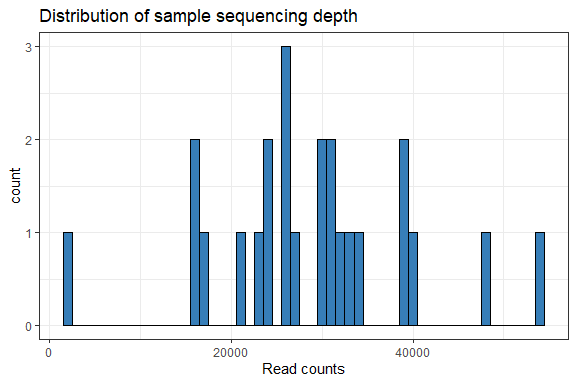
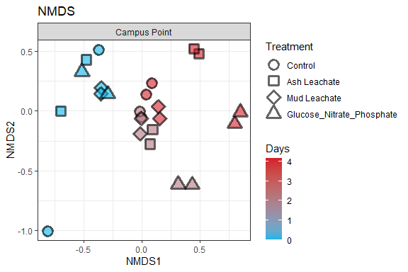

ASV analysis 1
================
Melvin Lin
11/19/2020

# Install phyloseq

``` r
# BiocManager::install("phyloseq")
```

``` r
library(tidyverse)
library(lubridate)
library(phyloseq)
library(RColorBrewer)
```

\#Import Data

``` r
count.tab <- read_rds("~/GITHUB/144l_students/Input_Data/week6/seqtab555.rds") #table of counts for each sequence in each sample
tax.tab <- read_rds("~/GITHUB/144l_students/Input_Data/week6/taxa555.rds") #table that matches ASV to sequence
sample.tab <- read_rds("~/GITHUB/144l_students/Output_Data/week4/TOCDOCProcessed.rds") %>% 
  group_by(Bottle) %>% 
  mutate(interv = interval(first(Datetime), Datetime),
         hours = as.numeric(interv)/3600, 
         days = hours/24) %>% 
  drop_na(DNA_SampleID) %>% 
  column_to_rownames(var = "DNA_SampleID") %>% 
  ungroup()
```

# Phyloseq Object

We need to create a phyloseq object that merges all three datasets.
Sometimes this does not work because of the format of the data files.
Make sure all sample names between the sampleinfo.txt and
seqtab-nochimtaxa.txt are the same

``` r
OTU = otu_table(count.tab, taxa_are_rows = TRUE)
TAX = tax_table(tax.tab)
SAM = sample_data(sample.tab)
ps = phyloseq(OTU, TAX, SAM)
```

# Filter sequences

We will filter out chloroplasts and mitochondria because we only
intended to amplify bacterial sequences. It’s good to check you don’t
have anything lurking in the taxonomy table.

``` r
sub_ps <- ps %>% 
  subset_taxa(Family != "mitochondria" & Order != "Chloroplast")
```

# Sample Summary

As a first analysis, we will look at the distribution of read counts
from our samples

``` r
# Make data frame with column for the read counts of each sample
sample_sum_df <- data.frame(sum = sample_sums(sub_ps))
#Histogram of sample read counts

ggplot(sample_sum_df, aes(x = sum)) +
  geom_histogram(color = "black", fill = "#377EB8", binwidth = 1000) +
  ggtitle("Distribution of sample sequencing depth") +
  xlab("Read counts") +
  theme(axis.title.y = element_blank()) + 
  theme_bw()
```

<!-- -->

``` r
# mean, max and min of sample read counts
summary(sample_sum_df)
```

    ##       sum       
    ##  Min.   : 2064  
    ##  1st Qu.:23419  
    ##  Median :28817  
    ##  Mean   :28789  
    ##  3rd Qu.:33569  
    ##  Max.   :53944

# Beta Diversity

Beta diversity involves calculating metrics such as distances or
dissimilarities based on pairwise comparisons of samples - they don’t
exist for a single sample, but rather only as metrics that relate
samples to each other. ex beta diversity = patterns in community
structure between samples

Since differences in sampling depths between samples can influence
distance/dissimilaritiy metrics, we first need to somehow normalize the
read depth across our samples.

## Subsample

We will rarefy (random subsample with replacement) the read depth of the
samples first (scale to the smallest library size).

A strong reason to subsample is to standardize effort. The bottom line
is that in all experimental design you should not be comparing things to
which you devote different effort in resolution. For instance, you don’t
sample one site once a week and another once a month if you want to
compare the dynamics between the sites. You standardize effort.

``` r
ps_min <- rarefy_even_depth(sub_ps, sample.size = min(sample_sums(sub_ps)))
```

    ## You set `rngseed` to FALSE. Make sure you've set & recorded
    ##  the random seed of your session for reproducibility.
    ## See `?set.seed`

    ## ...

    ## 123OTUs were removed because they are no longer 
    ## present in any sample after random subsampling

    ## ...

``` r
mean(sample_sums(sub_ps)) #28789
```

    ## [1] 28789.08

``` r
mean(sample_sums(ps_min)) #2064
```

    ## [1] 2064

\#\#NMDS

One of the best exploratory analyses for amplicon data is unconstrained
ordinations. Here we will look at non-metric multidimensional scaling
(NMDS) ordinations of our full community samples. For NMDS plots it’s
important to set a seed since the starting positions of samples in the
algorithm is random.

``` r
set.seed(1)
# Ordinate
nmds <- ordinate(sub_ps, method = "NMDS", distance = "bray")
```

    ## Square root transformation
    ## Wisconsin double standardization
    ## Run 0 stress 0.07505277 
    ## Run 1 stress 0.1441581 
    ## Run 2 stress 0.1563062 
    ## Run 3 stress 0.07505279 
    ## ... Procrustes: rmse 6.277719e-05  max resid 0.0002451769 
    ## ... Similar to previous best
    ## Run 4 stress 0.08428386 
    ## Run 5 stress 0.07705889 
    ## Run 6 stress 0.07705889 
    ## Run 7 stress 0.1598903 
    ## Run 8 stress 0.07700269 
    ## Run 9 stress 0.1595717 
    ## Run 10 stress 0.07642769 
    ## Run 11 stress 0.1203878 
    ## Run 12 stress 0.07574613 
    ## Run 13 stress 0.1440796 
    ## Run 14 stress 0.1590056 
    ## Run 15 stress 0.07700264 
    ## Run 16 stress 0.1441582 
    ## Run 17 stress 0.08428406 
    ## Run 18 stress 0.07505279 
    ## ... Procrustes: rmse 5.748865e-05  max resid 0.000206311 
    ## ... Similar to previous best
    ## Run 19 stress 0.083947 
    ## Run 20 stress 0.07505277 
    ## ... New best solution
    ## ... Procrustes: rmse 2.381677e-05  max resid 8.990675e-05 
    ## ... Similar to previous best
    ## *** Solution reached

``` r
#stress = 0.08
```

``` r
set.seed(1)
# Ordinate
nmds123 <- ordinate(ps_min, method = "NMDS", distance = "bray")
```

    ## Square root transformation
    ## Wisconsin double standardization
    ## Run 0 stress 0.09884003 
    ## Run 1 stress 0.151082 
    ## Run 2 stress 0.09884007 
    ## ... Procrustes: rmse 0.0005271637  max resid 0.001687015 
    ## ... Similar to previous best
    ## Run 3 stress 0.09946708 
    ## Run 4 stress 0.1102989 
    ## Run 5 stress 0.157321 
    ## Run 6 stress 0.1069987 
    ## Run 7 stress 0.1743323 
    ## Run 8 stress 0.09889471 
    ## ... Procrustes: rmse 0.02271467  max resid 0.09325279 
    ## Run 9 stress 0.1740695 
    ## Run 10 stress 0.09947514 
    ## Run 11 stress 0.1444949 
    ## Run 12 stress 0.1067038 
    ## Run 13 stress 0.1797858 
    ## Run 14 stress 0.1625102 
    ## Run 15 stress 0.09889544 
    ## ... Procrustes: rmse 0.02270506  max resid 0.09306054 
    ## Run 16 stress 0.09889478 
    ## ... Procrustes: rmse 0.02272271  max resid 0.09337126 
    ## Run 17 stress 0.09892094 
    ## ... Procrustes: rmse 0.01371079  max resid 0.05001092 
    ## Run 18 stress 0.09947529 
    ## Run 19 stress 0.1064753 
    ## Run 20 stress 0.1074779 
    ## *** Solution reached

``` r
#stress = 0.9
```

``` r
levels <- c("Control", "Ash Leachate", "Mud Leachate", "Glucose_Nitrate_Phosphate")


nmds.plot <- plot_ordination(sub_ps, nmds, title = "NMDS") +
  geom_point(aes(fill = days, shape = factor(Treatment, levels = levels)), alpha = 0.6, stroke = 2, size = 4) +
  scale_shape_manual(values = c(21, 22, 23, 24)) +
  scale_fill_gradient(low = "#0db5e6", high = "#d31f2a") +
  theme_bw()

#removing one of the plotting layers 
nmds.plot$layers <- nmds.plot$layers[-1]
nmds.plot + 
  facet_grid(~Location) +
  guides(fill = guide_colorbar(title = "Days"), shape = guide_legend(title = "Treatment"))
```

<!-- -->

# Alpha Diversity

Estimating alpha diversity of microbial communitites is problematic no
matter what you do.

We are going to calculate the Chao1 index for richness and the Shannon
diversity index.

\*\*it is important to note that alpha diversity values are not
interpretable as real numbers of anything, but they can still be useful
as relative metrics of comparison.

We will use the subsampled library, which retains estimates of the
species abundance of the real population while standardizing sampling
effort.

``` r
richness <- estimate_richness(ps_min, measures = c("Chao1", "Shannon")) %>% 
  rownames_to_column(., var = "DNA_ID") %>% 
  mutate_at(vars(DNA_ID), str_replace_all, pattern = "X144", "144") 
```

Let’s add the sample metadata into this dataframe

``` r
alphadiv <- left_join(richness, sample.tab %>% 
  rownames_to_column(., var = "DNA_ID"))
```

    ## Joining, by = "DNA_ID"

``` r
# install.packages("ggpubr")
library(ggpubr)

pivot.data <- alphadiv %>% 
  select(Treatment, Location, Bottle, Timepoint, days, Chao1, Shannon) %>% 
  pivot_longer(., cols = c(Chao1, Shannon), names_to = "measure", values_to = "est") %>% 
  left_join(., alphadiv %>% 
              select(Treatment, Location, Bottle, Timepoint, days, se.chao1)) %>% 
  mutate(se.chao1 = ifelse(measure == "Chao1", se.chao1, NA))

alpha.plot <- ggboxplot(pivot.data, x = "Timepoint", y = "est",
                        # color = "Location",
                        # palette = c("#0db5e6", "#d31f2a"),
                        xlab = expression(italic(paste(""))),
                        ylab = expression(italic(paste("Alpha Diversity Measure"))),
                        add = "dotplot",
                        width = 0.2,
                        ggtheme = theme_bw()) +
  stat_compare_means(label.x = "6") +
  facet_grid(measure~ factor(Treatment, levels = levels), scale = "free")

alpha.plot
```

<!-- -->

Boxes represent the 1.5 interquartile range, with the internal solid
line representing the median. Circles represent data points.

``` r
alpha.plot2 <- ggboxplot(pivot.data, x = "Treatment", y = "est",
                        # color = "Location",
                        # palette = c("#0db5e6", "#d31f2a"),
                        xlab = expression(italic(paste(""))),
                        ylab = expression(italic(paste("Alpha Diversity Measure"))),
                        add = "dotplot",
                        width = 0.2,
                        ggtheme = theme_bw()) +
  stat_compare_means(label.x = "Ash Leachate") +
  facet_grid(measure~Timepoint, scales = "free")

alpha.plot2
```

<!-- -->

# Who??

Which taxa were important? Which taxa were contributing to the change in
community composition?

First we are going to generate a custom table that will be easier to
work with than a phyloseq object.

## Generate relative abundances

Our data currently shows number gene copies recovered, so we’ll convert
to percentages (relative abundances)

``` r
ps_std <- transform_sample_counts(ps_min, function(x) x/sum(x)) #extract the relative abundance table and coerce into dataframe
ps_std.tab <- as(otu_table(ps_std), "matrix")
ps_std.df = as.data.frame(ps_std.tab)
```

## Make table

``` r
#first coerce the taxa table into a data frame
tax.df <- as.data.frame(tax.tab)
#then combine the data frames
custom.tab <- tax.df %>% 
  rownames_to_column(., var = "asv") %>% 
  left_join(., ps_std.df %>% rownames_to_column(., var = "asv")) %>% 
  mutate(pco = paste(Phylum, "_", Class, "_", Order)) %>% 
  select(-c(asv:Genus)) %>% 
  select(pco, everything()) %>% 
  group_by(pco) %>% 
  summarise_at(vars(1:24), sum, na.rm =T) %>% 
  ungroup()
```

    ## Joining, by = "asv"

``` r
# save row names and make them into column names
colnames <- custom.tab[,1]

#transpose the dataframe so we can merge with the sample info table
t_custom.tab <- as.data.frame(t(custom.tab[,-1]))
colnames(t_custom.tab) <- colnames$pco

#merge
sweet.tab <- t_custom.tab %>% 
  rownames_to_column(., var = "sample") %>% 
  left_join(., sample.tab %>% rownames_to_column(., var = "sample") %>%  select(sample, Experiment, Location, Bottle, Treatment, Timepoint, days, cells)) %>% 
  select(sample, Experiment:cells, everything())
```

    ## Joining, by = "sample"

``` r
relabund <- sweet.tab %>% 
  select(-c(sample:cells)) %>% 
  .[ , colSums(.) > 0] %>% 
  .[, order(colSums(-.))] %>% 
  bind_cols(sweet.tab %>% select(sample:cells), .)
```

## Heatmap

``` r
relaheat.data <- relabund %>% 
  select(-c(sample, Experiment, Location, Bottle, days, cells)) %>% 
  pivot_longer(-c(Treatment:Timepoint), names_to = "taxa", values_to = "relabund") %>% 
  separate(taxa, into = c("p", "c", "o"), sep = " _ ")

# install.packages("viridis")
library(viridis)

relaheat <- relaheat.data %>% 
  ggplot(aes(x = Timepoint, y = o)) +
  geom_tile(aes(fill = relabund), color = "white") +
  scale_fill_viridis(option = "D") +
  labs(x = "", y = "Order", fill = "Relative Abundance") +
  facet_grid(~factor(Treatment, levels = levels)) +
  theme_bw() +
  theme(axis.text.y = element_text(size = 12), 
        legend.position = "top") +
  guides(fill = guide_colourbar(barheight = 2, barwidth = 20, frame.colour = "black", frame.linewidth = 2, ticks.colour = "black", ticks.linewidth = 1), color = F)

relaheat
```

<!-- -->

# Save and knit

``` r
saveRDS(sweet.tab, "~/GITHUB/144l_students/Output_Data/week6/Custom_ASV_Table.rds")
saveRDS(sub_ps, "~/GITHUB/144l_students/Output_Data/week6/phyloseq_obj.rds")
saveRDS(ps_min, "~/GITHUB/144l_students/Output_Data/week6/subsampled_phyloseq_obj.rds")
saveRDS(alphadiv, "~/GITHUB/144l_students/Output_Data/week6/alphadiv.rds")
```
